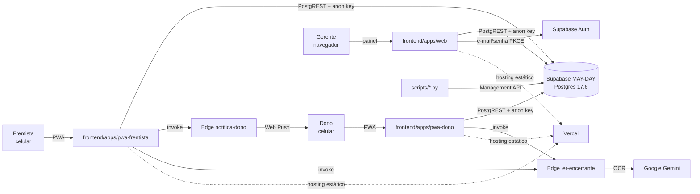
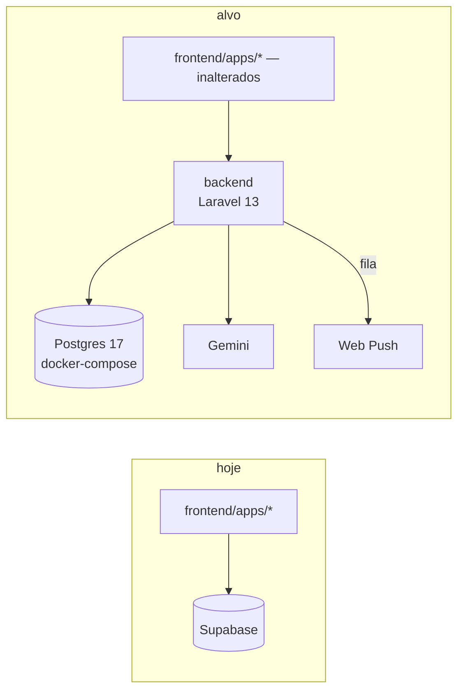
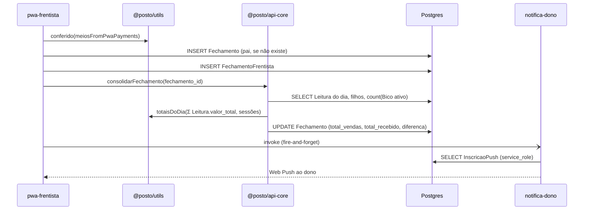

# Arquitetura — Posto Providência

> Mapa vivo exigido pelo `CLAUDE.md` §3. Atualizado a cada refatoração pelo subagente
> `doc-cycle-onboard` (ele propõe, a thread aplica). Levantamento completo e datado em
> [`.claude/docs/mapa-do-sistema-17-09-2026.md`](../.claude/docs/mapa-do-sistema-17-09-2026.md).
> **Última atualização:** 18/09/2026 (#103 item 1, fatias P0–P3: nasce `App\Fechamento` só com `Domain` de leitura — 4 models, sem Application, Http nem rota — e `'Fechamento' => []` no Pest Arch com canário; `fechamento-diario` ganha Public API `index.ts` e `leituras-diarias` passa a importar por ela; ver `docs/design/fechamento-diario-api.md`). Anterior: 18/09/2026 (#100 fatia 2: o dashboard do dono passa a ler `GET /api/postos/{posto}/dashboard` quando `VITE_API_URL` está definida — `services/api/dashboard.api.ts` + `insumosDaApi` em `aggregator.service.ts`; tela mista em `localhost`; ver `docs/design/agregacao.md`).

## 1. Contexto geral (nível 1)

## 2. Estado atual e alvo (nível 2)

**Hoje:** três SPAs falam direto com o Postgres do Supabase; a autorização é RLS (103 policies,
nenhuma filtra posto); o cálculo de dinheiro roda no cliente (`frontend/packages/utils`) e, em três RPCs,
dentro do banco.

**Alvo (Issue #60, Fase A):** as três SPAs continuam como estão e passam a falar com uma API
Laravel 13; o banco é Postgres próprio (esquema em `banco/init/`); autenticação e autorização
saem da RLS e vão para a aplicação; `frontend/packages/utils` permanece a fonte do cálculo.

## 3. Componentes (nível 3)

| Componente | Responsabilidade | Depende de | Tamanho (17/09) |
|---|---|---|---|
| `frontend/apps/web` | painel do gerente: 17 rotas, fechamento, leituras, compras, despesas, estoque. Módulos de `components/` seguem legado do strangler (fora das camadas do `eslint-plugin-boundaries`); desde 18/09 `fechamento-diario` expõe Public API em `index.ts` (`useLeituras`, `type Leitura` e o `default` da tela) e `leituras-diarias` importa por ela, não mais de `hooks/useLeituras` (#103 P2) | `@posto/utils`, `@posto/types`, `@posto/api-core`, supabase-js | 345 arquivos, 43 k linhas |
| `frontend/apps/pwa-frentista` | envio do fechamento do turno, tanques, vendas de loja, presença | `@posto/utils`, `@posto/api-core`, supabase-js | 19 arquivos, 2,8 k |
| `frontend/apps/pwa-dono` | encerrante por foto (OCR), envios do dia, push | `@posto/utils`, `@posto/api-core`, supabase-js | 19 arquivos, 2,5 k |
| `frontend/packages/utils` | domínio puro: `fechamento`, `lucro`, `leitura`, `planilha-mensal`, `troca-preco`… | `@posto/types` | 16 módulos, 18 golden |
| `frontend/packages/api-core` | consolidação do fechamento do dia e acesso ao OCR; recebe o client injetado | utils, types, supabase-js | 4 arquivos, 897 linhas |
| `frontend/packages/types` | tipos compartilhados | — | 7 arquivos |
| `banco/` | esquema completo (45 tabelas, 22 funções, 103 policies) + compose | Postgres 17 | gerado |
| `supabase/functions` | `ler-encerrante` (Gemini), `notifica-dono` (Web Push, `service_role`) | Deno | 2 funções |
| `scripts/` | ETL da planilha (2 estágios), cargas históricas, extração do esquema | Python stdlib, Management API | 11 scripts |
| `backend/` | Laravel 13.32: `GET /api/saude`; **Cadastro** (#97: 9 models + `Posto` em Compartilhado, `PertenceAoPosto`, catálogo só leitura em `/api/postos/{posto}/…`), **Pessoas** (Usuario, UsuarioPosto, `PostoPolicy`, movida de Cadastro em 18/09 para desfazer o ciclo) e **Agregacao** (#100 fatia 1: `GET /api/postos/{posto}/dashboard`, só leitura. `DadosDoPeriodo` usa query builder sobre `Leitura`, `Compra`, `Despesa` e `Combustivel`, sem model de módulo. Devolve venda por produto no período exato, compra e `rateio` no mês civil, tudo em string decimal, sem lucro nem divisão no PHP) e **Fechamento** (#103 item 1, P3, 18/09: só `Domain` de leitura — `Fechamento`, `FechamentoFrentista`, `Leitura`, `Recebimento` — sem Application, Http nem rota; `'Fechamento' => []` no mapa do Pest Arch, com canário registrado no comentário do mapa; `Leitura` não tem relação com `Fechamento`, o dia liga os dois por `posto_id` + dia UTC). Nenhum módulo depende de outro, e o Pest Arch cobra isso. Demais módulos nas #98+ | Postgres do compose, Pest (cobertura 100 %), PHPStan, PHPMD, Deptrac | 4 módulos |

**Regra de dependência:** `frontend/apps/*` importa de `frontend/packages/*`; `frontend/packages/*` nunca importa de app;
`frontend/apps/*` nunca se importam entre si. `backend` não importa nada do lado TS.

## 4. Comportamento: fechamento do dia (nível 4)

No alvo, os passos de `DB` e `EF` passam pela API; a decisão de onde `totaisDoDia` roda
(cliente TS ou servidor PHP com golden portado) é da issue do fechamento pela API.

**Dashboard do proprietário pela API (#100, fatia 2, endpoint com consumidor real):**
`DefinePostoAtual` → `DashboardRequest::periodo()` → `DadosDoPeriodo` (venda por `combustivel_id`
no período, compra e rateio no `Periodo::mesCivil()`, dia de `Leitura`/`Compra` tomado em UTC) →
`DashboardResource` (sem envelope `data`). No painel, `fetchDashboardData` (`aggregator.service.ts`)
escolhe a fonte por `urlDaApi()`: com `VITE_API_URL` e posto ativo, `insumosDaApi` lê o endpoint via
`frontend/apps/web/src/services/api/dashboard.api.ts` (schema Zod do §5 do Design Doc, `ResultAsync`,
reshape puro em `paraInsumosDeAgregacao`); sem a variável (a Vercel não a define), `insumosDoSupabase`,
o caminho de sempre. O cálculo continua no cliente: `custoMedioPorCombustivel()`
(`services/custo-do-mes.ts`) → `despesaOperacionalPorLitro()` → `lucroCombustivel()` de
`frontend/packages/utils`, as mesmas funções pelas duas fontes. A troca é parcial: a cor do combustível
(`codigo`), estoque, frentistas, formas de pagamento e fechamentos seguem no Supabase, então em
`localhost` com `VITE_API_URL` a tela é **mista** (venda/lucro do Postgres local, frentistas e
fechamentos da produção). Falha da API derruba o dashboard com `FETCH_ERROR`, sem cair na fonte antiga.

## 5. Contratos (nível 5)

Os contratos de entrada e saída da API são definidos no Design Doc de cada módulo em
`docs/design/` (`GET /api/postos/{posto}/dashboard`: `docs/design/agregacao.md` §5, com o bloco
`rateio { mes_civil, despesas_total, litros_vendidos }` e sem `despesas_total` na raiz). Hoje o contrato de dados é o esquema em `banco/init/01-esquema-base.sql`
(colunas, tipos `numeric`, enums `Role` e `StatusFechamento`) e os tipos de
`frontend/packages/types`. Convenção de dinheiro: `numeric(15,2)` no banco, reais-float quantizado por
`emCentavos` na fronteira de toda fórmula em TS.
