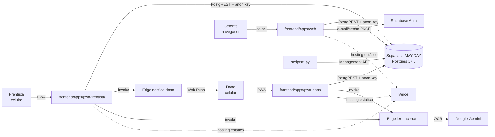
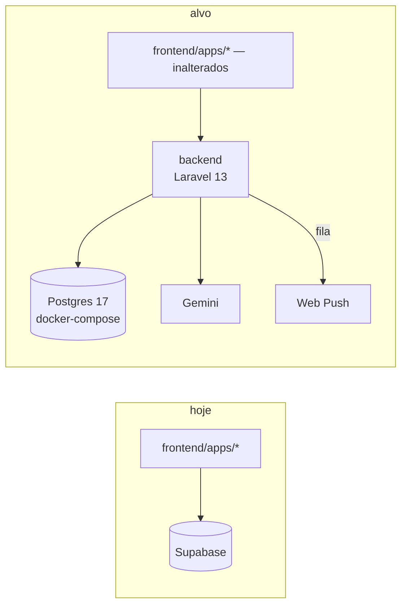
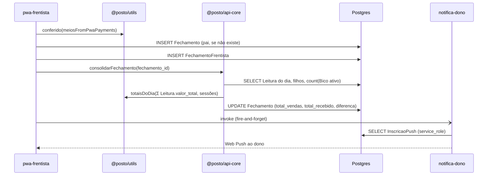
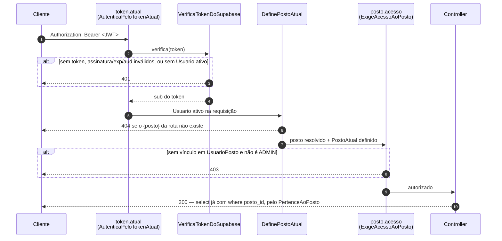

# Arquitetura — Posto Providência

> Mapa vivo exigido pelo `CLAUDE.md` §3. Atualizado a cada refatoração pelo subagente
> `doc-cycle-onboard` (ele propõe, a thread aplica). Levantamento completo e datado em
> [`.claude/docs/mapa-do-sistema-17-09-2026.md`](../.claude/docs/mapa-do-sistema-17-09-2026.md).
> **Última atualização:** 21/09/2026 (#103 item 1, fatias **P10/P11**: nasce a **ESCRITA**. `App\Fechamento` deixa de ser só leitura e ganha `Domain\{JanelaDeEscrita, TotaisDeclarados, RecusaDaGravacao}`, `Application\{DiaDeclarado, GravaFechamentoDoDia, GravaFilhosDoDia}` e `Http\{Requests\GravaFechamentoDoDiaRequest, Resources\RespostaDaGravacao}`, mais `FechamentoController::update` e a **primeira rota não-GET do sistema**, `PUT /api/postos/{posto}/fechamento?data=`, dentro do grupo protegido. O `ExigeAcessoAoPosto` passa a receber a habilidade **por parâmetro** (`posto.acesso:gerir`) em vez de ganhar uma classe irmã. **A primeira aresta entre módulos por evento passa a ser exercida:** o Command emite `App\Compartilhado\Eventos\LeiturasDoDiaGravadas` depois do commit, e `App\Estoque\Application\DescontaLitrosVendidos` ouve — `Fechamento` continua sem importar `Estoque` (CA-7), e o mapa do Pest Arch segue `'Fechamento' => []`. No painel, `base.ts` ganha `enviarParaApi` e o `handleSave` desvia por `VITE_API_URL`, com o legado do Supabase extraído intacto para `gravacaoLegadaSupabase.ts`. **Nasce desligada em produção**: sem `auth_user_id` o PUT dá 401, e a Vercel não tem `VITE_API_URL`. Ver `docs/design/fechamento-diario-api.md` §5.2). Anterior: 20/09/2026 (#102, commit `465efd5`: nasce o **guard da transição** — `App\Pessoas` ganha `Application\VerificaTokenDoSupabase`, que confere o JWT HS256 do Supabase **sem biblioteca** (`hash_hmac`, `hash_equals`, falha fechada quando o segredo vem vazio), e `Http\Middleware\{AutenticaPeloTokenAtual, ExigeAcessoAoPosto}`: o primeiro resolve o `sub` do token para `Usuario.auth_user_id` **só se ativo**, o segundo aplica a `PostoPolicy` e devolve 403; aliases `token.atual` e `posto.acesso` em `bootstrap/app.php`, binding em `AppServiceProvider`, configuração em `config/supabase.php`. **Nenhuma rota de produção mudou** — o catálogo segue público em `routes/api.php:47-61` e as rotas protegidas existem só nos testes. Entra também o gate de escopo de tenant `backend/tests/Feature/Arquitetura/EscopoDeTenantTest.php` (família TEN de `docs/arquitetura/regras.md`), e **multi-tenant passa a ser o destino declarado** da refatoração — ver §2 e o rascunho `docs/design/multi-tenant.md`, que precisa de decisão do dono). Anterior: 19/09/2026 (#103 item 1, fatias P4a/P4b: o catálogo do `fechamento-diario` — frentistas, bicos e formas de pagamento — passa a vir das rotas da #97 quando `VITE_API_URL` está definida, via `services/api/{frentista,bico,formaPagamento}.api.ts` (Zod + `ResultAsync`, filtro `ativo` no cliente), trocado no call site dos hooks e nunca dentro dos services partilhados com o `aggregator`; leituras, sessões, recebimentos e a gravação seguem no Supabase, tela mista só para validação de leitura; ver `docs/design/fechamento-diario-api.md` §Riscos). Anterior: 18/09/2026 (#103 item 1, fatias P0–P3: nasce `App\Fechamento` só com `Domain` de leitura — 4 models, sem Application, Http nem rota — e `'Fechamento' => []` no Pest Arch com canário; `fechamento-diario` ganha Public API `index.ts` e `leituras-diarias` passa a importar por ela). Anterior: 18/09/2026 (#100 fatia 2: o dashboard do dono passa a ler `GET /api/postos/{posto}/dashboard` quando `VITE_API_URL` está definida — `services/api/dashboard.api.ts` + `insumosDaApi` em `aggregator.service.ts`; tela mista em `localhost`; ver `docs/design/agregacao.md`).

## 1. Contexto geral (nível 1)

## 2. Estado atual e alvo (nível 2)

**Hoje:** três SPAs falam direto com o Postgres do Supabase; a autorização é RLS (103 policies,
nenhuma filtra posto); o cálculo de dinheiro roda no cliente (`frontend/packages/utils`) e, em três RPCs,
dentro do banco.

**Alvo (Issue #60, Fase A):** as três SPAs continuam como estão e passam a falar com uma API
Laravel 13; o banco é Postgres próprio (esquema em `banco/init/`); autenticação e autorização
saem da RLS e vão para a aplicação; `frontend/packages/utils` permanece a fonte do cálculo.

**Por que a refatoração existe (dono, 20/09/2026).** O sistema nasceu de vibecoding e foi refatorado
quando cresceu (`types`, `utils`, hooks), com testes ao fim de cada commit como a peça que fazia dar
certo. **O que ficou de fora foi o multi-tenant — e é ele a migração para os demais postos.** Sair do
Supabase é para o dado não ficar preso lá e para ter o controle do sistema; a API multi-tenant para
vários postos é também o portfólio, um caso real de trabalho. É daí que vêm as travas de arquitetura,
clean code, SOLID, spec-driven, análise ciclomática, TDD e DevOps em VPS.

**Consequência de arquitetura:** o escopo por `posto_id`, o trait `PertenceAoPosto`, o middleware
`DefinePostoAtual` e o prefixo de rota `postos/{posto}` **são fundação, não peso morto**. Toda tabela de
domínio com `posto_id` é um tenant escopado, e a trava que cobra isso é o gate
`backend/tests/Feature/Arquitetura/EscopoDeTenantTest.php` (regra TEN-1 de
`docs/arquitetura/regras.md`), que nasceu em 20/09 porque nenhum gate anterior — Deptrac, PHPStan 9,
PHPMD, Pest Arch — sabe o que é tenant.

> ⚠️ **Contradição registrada, não resolvida aqui:** `docs/design/fase-a-laravel.md` (DECISÃO 5) e a
> issue #93 dizem "uma instalação por posto, banco compartilhado ainda não sei, talvez sim".
> `docs/design/cutover.md` já registra que a #93 "muda de sentido". O rumo de 20/09 vai além dos dois:
> multi-tenant é o destino, não a porta aberta. **Precisa de decisão do dono.**

## 3. Componentes (nível 3)

| Componente | Responsabilidade | Depende de | Tamanho (17/09) |
|---|---|---|---|
| `frontend/apps/web` | painel do gerente: 17 rotas, fechamento, leituras, compras, despesas, estoque. Módulos de `components/` seguem legado do strangler (fora das camadas do `eslint-plugin-boundaries`); desde 18/09 `fechamento-diario` expõe Public API em `index.ts` (`useLeituras`, `type Leitura` e o `default` da tela) e `leituras-diarias` importa por ela, não mais de `hooks/useLeituras` (#103 P2); desde 19/09, com `VITE_API_URL`, `useCarregamentoDados`, `useSessoesFrentistas` e `usePagamentos` leem frentistas, bicos e formas de pagamento de `services/api/{frentista,bico,formaPagamento}.api.ts` (#103 P4a/P4b) — o resto do dia e a gravação seguem no Supabase | `@posto/utils`, `@posto/types`, `@posto/api-core`, supabase-js | 345 arquivos, 43 k linhas |
| `frontend/apps/pwa-frentista` | envio do fechamento do turno, tanques, vendas de loja, presença | `@posto/utils`, `@posto/api-core`, supabase-js | 19 arquivos, 2,8 k |
| `frontend/apps/pwa-dono` | encerrante por foto (OCR), envios do dia, push | `@posto/utils`, `@posto/api-core`, supabase-js | 19 arquivos, 2,5 k |
| `frontend/packages/utils` | domínio puro: `fechamento`, `lucro`, `leitura`, `planilha-mensal`, `troca-preco`… | `@posto/types` | 16 módulos, 18 golden |
| `frontend/packages/api-core` | consolidação do fechamento do dia e acesso ao OCR; recebe o client injetado | utils, types, supabase-js | 4 arquivos, 897 linhas |
| `frontend/packages/types` | tipos compartilhados | — | 7 arquivos |
| `banco/` | esquema completo (45 tabelas, 22 funções, 103 policies) + compose | Postgres 17 | gerado |
| `supabase/functions` | `ler-encerrante` (Gemini), `notifica-dono` (Web Push, `service_role`) | Deno | 2 funções |
| `scripts/` | ETL da planilha (2 estágios), cargas históricas, extração do esquema | Python stdlib, Management API | 11 scripts |
| `backend/` | Laravel 13.32: `GET /api/saude`; **Cadastro** (#97: 9 models + `Posto` em Compartilhado, `PertenceAoPosto`, catálogo só leitura em `/api/postos/{posto}/…`), **Pessoas** (Usuario, UsuarioPosto, `PostoPolicy`, movida de Cadastro em 18/09 para desfazer o ciclo; desde 20/09, pela #102, ganha `Application\VerificaTokenDoSupabase` — JWT HS256 do Supabase, puro, sem HTTP nem Eloquent — e `Http\Middleware\{AutenticaPeloTokenAtual, ExigeAcessoAoPosto}`, que formam o guard da DECISÃO A. É o **único módulo com peça de prazo de validade**, porque `VerificaTokenDoSupabase` morre quando o Sanctum virar emissor) e **Agregacao** (#100 fatia 1: `GET /api/postos/{posto}/dashboard`, só leitura. `DadosDoPeriodo` usa query builder sobre `Leitura`, `Compra`, `Despesa` e `Combustivel`, sem model de módulo. Devolve venda por produto no período exato, compra e `rateio` no mês civil, tudo em string decimal, sem lucro nem divisão no PHP) e **Fechamento** (#103 item 1, P3, 18/09: só `Domain` de leitura — `Fechamento`, `FechamentoFrentista`, `Leitura`, `Recebimento` — sem Application, Http nem rota; `'Fechamento' => []` no mapa do Pest Arch, com canário registrado no comentário do mapa; `Leitura` não tem relação com `Fechamento`, o dia liga os dois por `posto_id` + dia UTC. **Desde 21/09, pelas P10/P11, é o primeiro módulo que ESCREVE**: `GravaFechamentoDoDia` transacional, rota `PUT`, e emissão de `LeiturasDoDiaGravadas` para o `Estoque` ouvir sem que haja import entre os dois). Nenhum módulo depende de outro, e o Pest Arch cobra isso. Desde 20/09 o **escopo de tenant** também é cobrado, pelo `tests/Feature/Arquitetura/EscopoDeTenantTest.php`: ele lê o `information_schema` e reprova model em tabela com `posto_id` sem `PertenceAoPosto` (exceção justificada: `UsuarioPosto`), e exige que model **sem** `posto_id` declare como é escopado (`Posto` = tenant-raiz; `Usuario` = atravessa tenants; `Recebimento` = escopado pelo pai `fechamento_id`; `App\Models\User` = sobra do instalador, dívida declarada). Demais módulos nas #98+ | Postgres do compose, Pest (cobertura 100 %), PHPStan, PHPMD, Deptrac | 4 módulos |

**Regra de dependência:** `frontend/apps/*` importa de `frontend/packages/*`; `frontend/packages/*` nunca importa de app;
`frontend/apps/*` nunca se importam entre si. `backend` não importa nada do lado TS.

## 4. Comportamento: fechamento do dia (nível 4)

No alvo, os passos de `DB` e `EF` passam pela API; a decisão de onde `totaisDoDia` roda
(cliente TS ou servidor PHP com golden portado) é da issue do fechamento pela API.

**Dashboard do proprietário pela API (#100, fatia 2, endpoint com consumidor real):**
`DefinePostoAtual` → `DashboardRequest::periodo()` → `DadosDoPeriodo` (venda por `combustivel_id`
no período, compra e rateio no `Periodo::mesCivil()`, dia de `Leitura`/`Compra` tomado em UTC) →
`DashboardResource` (sem envelope `data`). No painel, `fetchDashboardData` (`aggregator.service.ts`)
escolhe a fonte por `urlDaApi()`: com `VITE_API_URL` e posto ativo, `insumosDaApi` lê o endpoint via
`frontend/apps/web/src/services/api/dashboard.api.ts` (schema Zod do §5 do Design Doc, `ResultAsync`,
reshape puro em `paraInsumosDeAgregacao`); sem a variável (a Vercel não a define), `insumosDoSupabase`,
o caminho de sempre. O cálculo continua no cliente: `custoMedioPorCombustivel()`
(`services/custo-do-mes.ts`) → `despesaOperacionalPorLitro()` → `lucroCombustivel()` de
`frontend/packages/utils`, as mesmas funções pelas duas fontes. A troca é parcial: a cor do combustível
(`codigo`), estoque, frentistas, formas de pagamento e fechamentos seguem no Supabase, então em
`localhost` com `VITE_API_URL` a tela é **mista** (venda/lucro do Postgres local, frentistas e
fechamentos da produção). Falha da API derruba o dashboard com `FETCH_ERROR`, sem cair na fonte antiga.

**Catálogo do fechamento diário pela API (#103 P4a/P4b, 19/09):** os três hooks do módulo
`fechamento-diario` que carregam cadastro escolhem a fonte por `urlDaApi()` **no call site** —
`useCarregamentoDados` (bicos e frentistas), `useSessoesFrentistas` (frentistas, no fallback sem
`frentistasCadastrados`) e `usePagamentos` (formas de pagamento). Com `VITE_API_URL`, `GET
/api/postos/{posto}/{bicos,frentistas,formas-pagamento}` via
`services/api/{bico,frentista,formaPagamento}.api.ts` (`buscarNaApi` + Zod + `ResultAsync`; o
`match` devolve o `ApiResponse` legado que o hook já consumia); sem ela, `bicoService.getWithDetails`,
`frentistaService.getAll` e `formaPagamentoService.getAll`, como sempre. Os services não mudam porque
o `aggregator.service.ts` usa os mesmos métodos e é sítio de fórmula. `CatalogoDoPosto` não filtra
`ativo`, então o filtro é do cliente (os `*.api.ts`), e `preco_venda`/`taxa` chegam em string decimal e
viram `number` por `Number()` — o mesmo valor que o PostgREST entregava; nenhuma conta muda. A tela é
**mista**: leituras, sessões, recebimentos e a **gravação** seguem na fonte atual, então o modo
`VITE_API_URL` é só para validar leitura até P11 (`fechamento-diario-api.md` §Riscos).

**Requisição protegida pelo guard da transição (#102, 20/09):** existe no backend e **ainda sem
consumidor em produção** — nenhuma rota do catálogo entrou no grupo protegido; a ordem abaixo só é
exercitada por rotas declaradas dentro dos testes.

Três propriedades que são decisão, não detalhe:

- **Falha fechada:** sem `SUPABASE_JWT_SECRET`, o verificador nasce com segredo vazio e recusa **todo**
  token. Configuração faltando nega, nunca libera.
- **401 e não 403 no primeiro portão:** quem se desligou continua com token válido no Supabase até
  expirar, e ali ainda não se sabe qual posto foi pedido — a distinção é da policy.
- **Guard fora de ordem é 500, não 403:** erro de configuração de rota não se disfarça de negativa de
  acesso.

**Condição de saída:** `VerificaTokenDoSupabase` é a única peça descartável; morre quando
`AuthContext.tsx` parar de chamar `supabase.auth`. Os middlewares e a `PostoPolicy` ficam, porque o que
muda é **quem assina o token**, não como identidade vira autorização.

## 5. Contratos (nível 5)

Os contratos de entrada e saída da API são definidos no Design Doc de cada módulo em
`docs/design/` (`GET /api/postos/{posto}/dashboard`: `docs/design/agregacao.md` §5, com o bloco
`rateio { mes_civil, despesas_total, litros_vendidos }` e sem `despesas_total` na raiz). Hoje o contrato de dados é o esquema em `banco/init/01-esquema-base.sql`
(colunas, tipos `numeric`, enums `Role` e `StatusFechamento`) e os tipos de
`frontend/packages/types`. Convenção de dinheiro: `numeric(15,2)` no banco, reais-float quantizado por
`emCentavos` na fronteira de toda fórmula em TS.

**Contrato de identidade durante a transição (#102).** `Authorization: Bearer <JWT do Supabase Auth>`;
o `sub` do token casa com `Usuario.auth_user_id` (`banco/init/01-esquema-base.sql:510`, FK para
`auth.users(id)` em `:731`); audiência exigida `authenticated` (`backend/config/supabase.php`); folga de
relógio de 10 s em `exp`/`nbf`; respostas 401 (token ausente, inválido ou sem `Usuario` ativo), 403 (sem
vínculo com o posto e não ADMIN) e 500 (guard fora de ordem), conforme o §4. **Nenhuma rota de produção
usa esse contrato hoje.**

