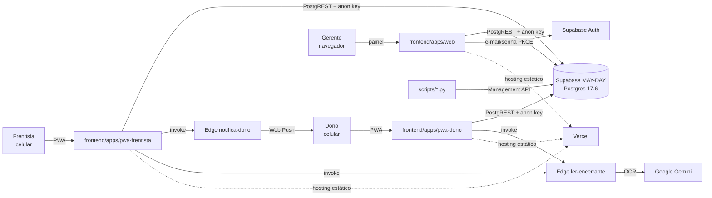
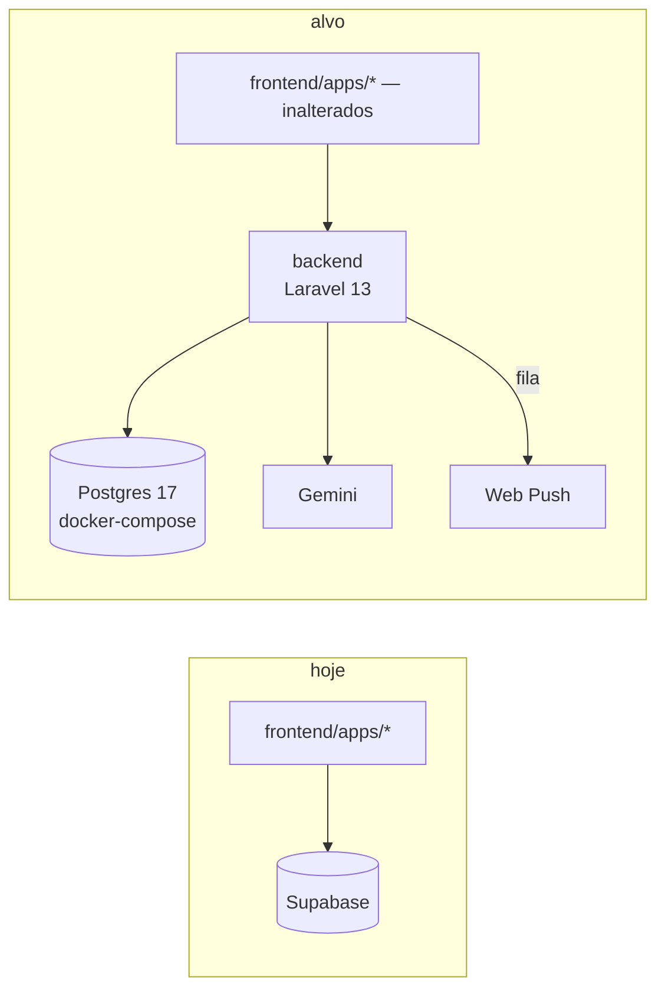
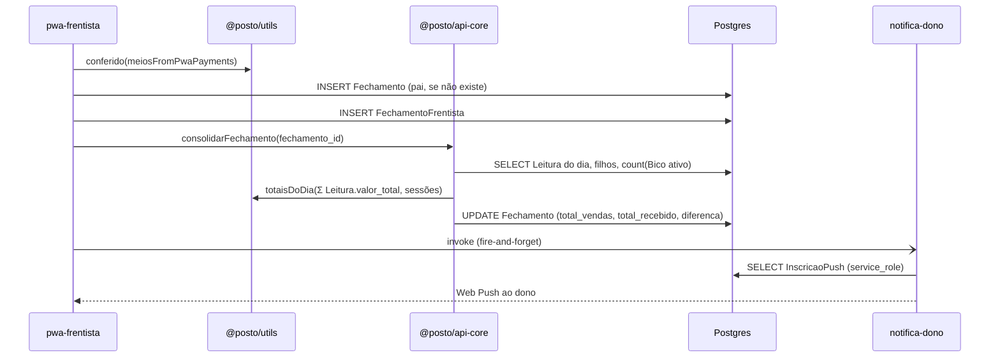

# Arquitetura — Posto Providência

> Mapa vivo exigido pelo `CLAUDE.md` §3. Atualizado a cada refatoração pelo subagente
> `doc-cycle-onboard` (ele propõe, a thread aplica). Levantamento completo e datado em
> [`.claude/docs/mapa-do-sistema-17-09-2026.md`](../.claude/docs/mapa-do-sistema-17-09-2026.md).
> **Última atualização:** 17/09/2026.

## 1. Contexto geral (nível 1)

## 2. Estado atual e alvo (nível 2)

**Hoje:** três SPAs falam direto com o Postgres do Supabase; a autorização é RLS (103 policies,
nenhuma filtra posto); o cálculo de dinheiro roda no cliente (`frontend/packages/utils`) e, em três RPCs,
dentro do banco.

**Alvo (Issue #60, Fase A):** as três SPAs continuam como estão e passam a falar com uma API
Laravel 13; o banco é Postgres próprio (esquema em `banco/init/`); autenticação e autorização
saem da RLS e vão para a aplicação; `frontend/packages/utils` permanece a fonte do cálculo.

## 3. Componentes (nível 3)

| Componente | Responsabilidade | Depende de | Tamanho (17/09) |
|---|---|---|---|
| `frontend/apps/web` | painel do gerente: 17 rotas, fechamento, leituras, compras, despesas, estoque | `@posto/utils`, `@posto/types`, `@posto/api-core`, supabase-js | 345 arquivos, 43 k linhas |
| `frontend/apps/pwa-frentista` | envio do fechamento do turno, tanques, vendas de loja, presença | `@posto/utils`, `@posto/api-core`, supabase-js | 19 arquivos, 2,8 k |
| `frontend/apps/pwa-dono` | encerrante por foto (OCR), envios do dia, push | `@posto/utils`, `@posto/api-core`, supabase-js | 19 arquivos, 2,5 k |
| `frontend/packages/utils` | domínio puro: `fechamento`, `lucro`, `leitura`, `planilha-mensal`, `troca-preco`… | `@posto/types` | 16 módulos, 18 golden |
| `frontend/packages/api-core` | consolidação do fechamento do dia e acesso ao OCR; recebe o client injetado | utils, types, supabase-js | 4 arquivos, 897 linhas |
| `frontend/packages/types` | tipos compartilhados | — | 7 arquivos |
| `banco/` | esquema completo (45 tabelas, 22 funções, 103 policies) + compose | Postgres 17 | gerado |
| `supabase/functions` | `ler-encerrante` (Gemini), `notifica-dono` (Web Push, `service_role`) | Deno | 2 funções |
| `scripts/` | ETL da planilha (2 estágios), cargas históricas, extração do esquema | Python stdlib, Management API | 11 scripts |
| `backend` | **a criar** — persistência, auth, autorização, OCR, push, agregações | Laravel 13, Postgres | — |

**Regra de dependência:** `frontend/apps/*` importa de `frontend/packages/*`; `frontend/packages/*` nunca importa de app;
`frontend/apps/*` nunca se importam entre si. `backend` não importa nada do lado TS.

## 4. Comportamento: fechamento do dia (nível 4)

No alvo, os passos de `DB` e `EF` passam pela API; a decisão de onde `totaisDoDia` roda
(cliente TS ou servidor PHP com golden portado) é da issue do fechamento pela API.

## 5. Contratos (nível 5)

Os contratos de entrada e saída da API são definidos no Design Doc de cada módulo em
`docs/design/`. Hoje o contrato de dados é o esquema em `banco/init/01-esquema-base.sql`
(colunas, tipos `numeric`, enums `Role` e `StatusFechamento`) e os tipos de
`frontend/packages/types`. Convenção de dinheiro: `numeric(15,2)` no banco, reais-float quantizado por
`emCentavos` na fronteira de toda fórmula em TS.
