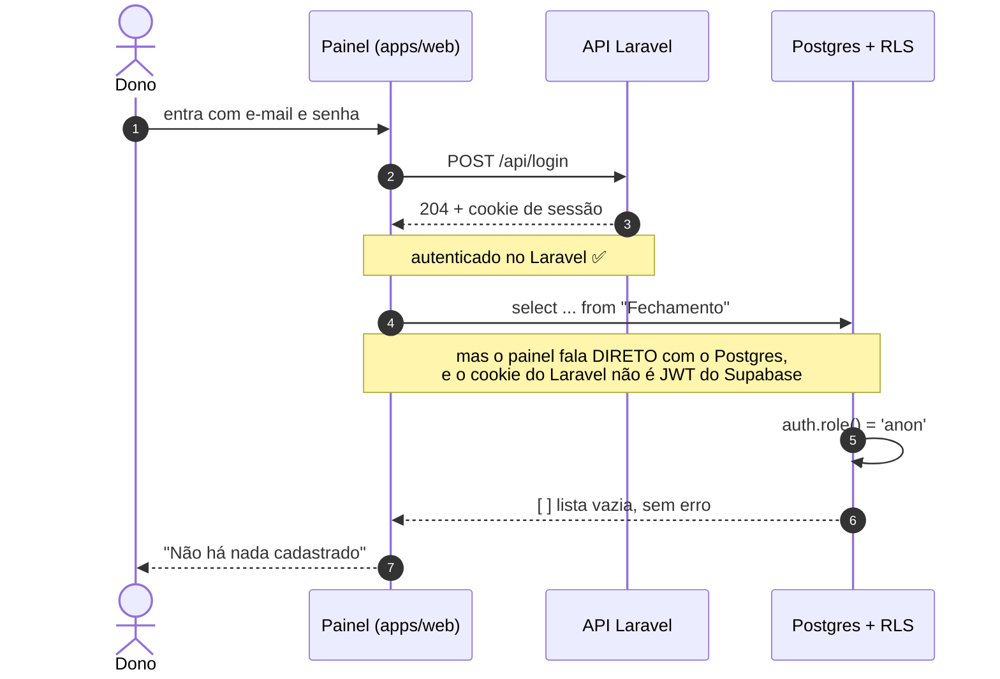
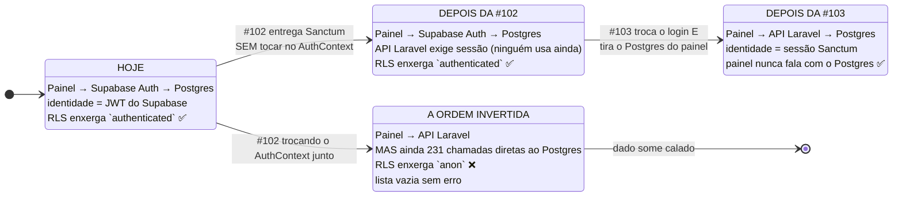
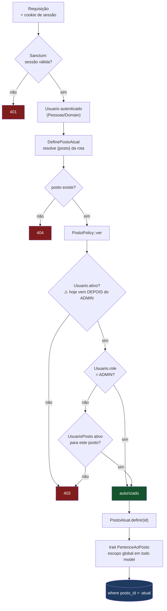
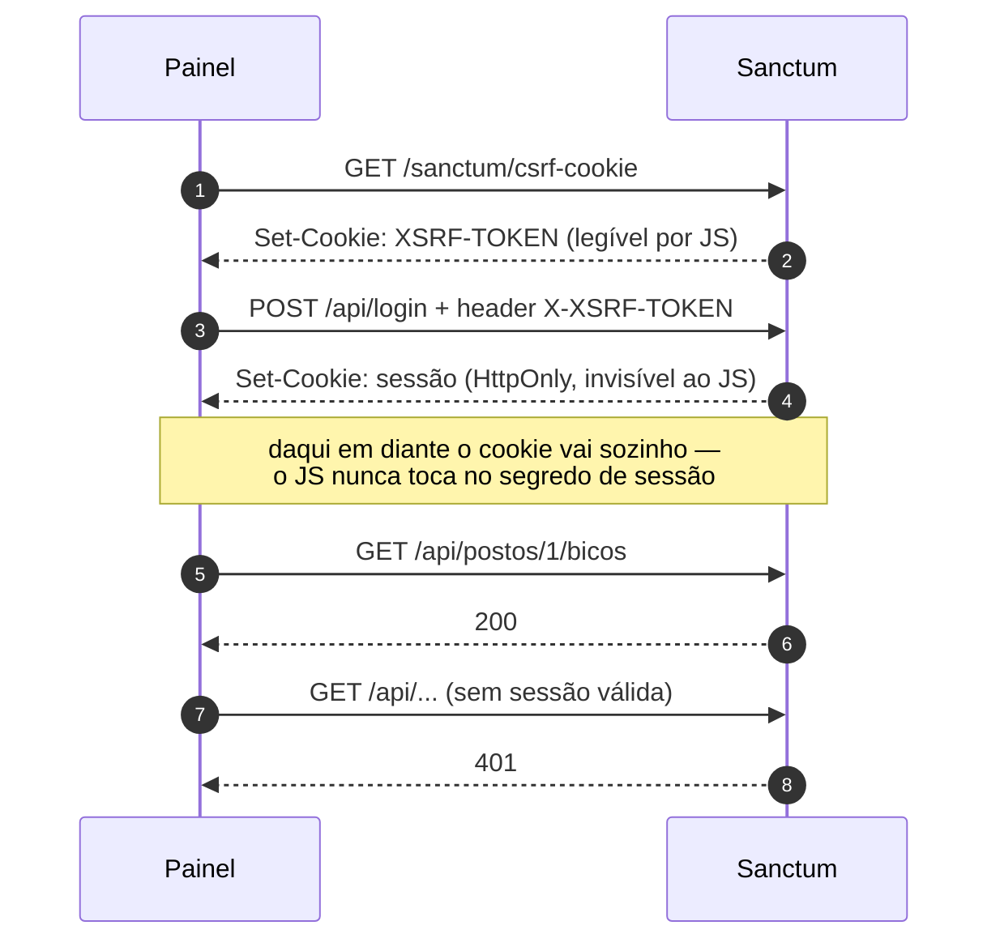

# Autenticação do painel — Design Doc

Issue: #102 (mãe: #60) · Estado: **rascunho — pendências do dono: instalar Sanctum e escolher o SMTP** · Data: 17/09/2026

> Chave de abóbada da Fase A: destrava #101, #103 e #104. É também a issue onde `UsuarioPosto`,
> `Usuario.role` e a `PostoPolicy` da #97 finalmente passam a valer.
> Fonte do levantamento: `.claude/agent-memory/grafo/superficie-autenticacao-web.md` (17/09).
> Diagramas Mermaid (CLAUDE.md §3) acrescentados em 18/09 — o texto do desenho original foi preservado.

## 1. Contexto — hoje logar no painel *remove* trava

Não é força de expressão. As policies de RLS dão mais permissão a `authenticated` do que a `anon`, e
**nenhuma regra viva consulta `UsuarioPosto` ou `Usuario.role`**. O efeito prático: autenticar hoje é
elevação de privilégio sem escopo nenhum. Qualquer um dos 16 usuários enxerga qualquer posto.

A #97 já construiu o remédio — `PertenceAoPosto`, `PostoAtual`, `PostoPolicy` — mas deixou tudo sem
dente, porque não havia usuário autenticado. Esta issue é onde os dentes nascem.

## 2. Subsistema

`App\Pessoas` (já existe desde a #97) ganha `AutenticacaoController`, Sanctum em modo SPA (cookie de
sessão, não token), e o registro das Policies nas rotas.

## 3. ⚠️ O problema central: sessão Laravel não é JWT do Supabase

**Este é o achado que reordena a issue.**

As policies de RLS distinguem `anon` de `authenticated` chamando `auth.role()` — **24 das 103
policies** do esquema fazem isso. Uma sessão Laravel não produz JWT do Supabase. Logo:

> Enquanto o painel continuar falando direto com o Postgres, **um usuário logado no Laravel é `anon`
> no banco.**

#### A janela `anon`, passo a passo

O perigo não é o login falhar — é ele **dar certo** e o banco não saber disso:



O passo 8 é o problema inteiro: a RLS **não devolve erro**, devolve vazio. O painel não tem como
distinguir "não existe" de "não pode ver", e mostra a frase errada com a cara de normalidade.

Já aconteceu aqui, com esta assinatura exata — *"Reset do painel apaga em silêncio: roda como `anon`,
a RLS engole o erro, o app reporta sucesso com zeros."*

#### Onde mora a identidade, em cada fase



A leitura: o painel só pode trocar de identidade **no mesmo movimento** em que para de falar com o
Postgres. Qualquer estado intermediário é o `X`.


E este repositório já tem cicatriz exata desse modo de falha: *"Reset do painel apaga em silêncio —
roda como `anon`, a RLS engole o erro, o app reporta sucesso com zeros."* Repetir isso agora seria
perder dado de produção com o sistema "funcionando".

### DECISÃO 1 — a #102 **não** troca o `AuthContext`. Essa tarefa muda para a #103.

A issue lista "`AuthContext.tsx` troca `supabase.auth.*` por `/api/login`". Se isso entrar na #102,
abre-se uma janela — entre a #102 e a #103 — em que o painel está autenticado no Laravel e `anon` no
Postgres, e ainda fala direto com o Postgres em 231 chamadas. É a janela onde o dado some calado.

Sessão dupla não resolve: a migração de senha (§4) faz a senha do Laravel **divergir** da do
Supabase, então não dá para logar nos dois com a mesma credencial.

**Escopo corrigido:**

| Issue | Entrega |
|---|---|
| **#102** | Sanctum, migração dos 16 usuários, Policies com dente, **toda rota da API exigindo sessão**. O painel continua logando no Supabase. |
| **#103** | O painel para de falar com o Postgres **e** troca o login na mesma entrega. Nunca há um momento `anon`. |

Custo: a #102 deixa de ter efeito visível no painel. Ganho: não existe janela de perda silenciosa.
Isso precisa ser corrigido no texto das duas issues.

## 4. Comportamento

### Migração dos 16 usuários — é um evento operacional, não um `INSERT`

O hash de senha do Supabase **não é migrável**. Os 16 usuários (você inclusive) recebem link de
redefinição. Consequências que precisam estar combinadas antes, não durante:

- É preciso **SMTP no `.env` do backend**. Hoje quem manda e-mail é o SMTP embutido do Supabase, que
  vai embora no cutover. **Pendência sua:** qual provedor. É custo recorrente novo, ainda que baixo.
- Se o e-mail não sair, ninguém entra no painel. O `php artisan` precisa de um caminho de
  redefinição manual para o primeiro ADMIN, senão um SMTP mal configurado tranca todo mundo do lado
  de fora — o mesmo cuidado do sudoers.
- `Usuario` já tem o e-mail, então o casamento é por e-mail. Conferir duplicata e e-mail vazio
  **antes** de migrar, não depois.

### Papéis ganham dente

`Role` (`ADMIN`, `GERENTE`, `OPERADOR`, `FRENTISTA`) e `UsuarioPosto` passam a decidir de verdade,
via a `PostoPolicy` que a #97 já escreveu e registrou no Gate. O aceite da issue é bom e fica:
**usuário sem `UsuarioPosto` não vê nada.** Teste explícito para isso.

A cadeia completa, do cookie ao `where posto_id = ?`:



Três coisas que o desenho deixa explícitas e o texto não:

- **⚠️ `ADMIN` inativo passa hoje — a #102 corrige no código.** O desenho acima é o alvo: `ativo`
  é a primeira pergunta da policy. A `PostoPolicy` da #97 faz o contrário — `ver` e `gerir` devolvem
  `true` para `ADMIN` **antes** de olhar `ativo`, que só é conferido dentro de `vinculoAtivo()`, no
  ramo de quem não é ADMIN. Um ADMIN desativado continua vendo e gerindo todos os postos. Hoje é
  inócuo (nenhuma rota usa a policy), mas vira buraco no dia em que a #102 a pendura nas rotas.
  Tarefa da #102: conferir `Usuario.ativo` antes do ramo ADMIN, nos dois métodos, com o teste
  "ADMIN inativo → 403" (ver Testes). O login também recusa inativo, mas a policy não pode contar
  com isso: sessão aberta antes da desativação continua válida.

- **`gerir` não aparece aqui.** O fluxo acima é o de leitura (`ver`). A escrita exige `gerir`, que
  além do vínculo ativo cobra `UsuarioPosto.role` ∈ {`admin`, `gerente`}. Como a #102 não entrega
  endpoint de escrita, esse ramo nasce testado e sem uso — de propósito.
- **O escopo por posto é a última linha de defesa, não a primeira.** Mesmo que a policy passasse por
  engano, o trait ainda corta o `select` no posto atual. É a defesa em profundidade que a RLS
  sozinha nunca deu.


### O portão do frontend é um componente só

Não existe rota protegida no painel: o gate é o `PortaDeEntrada` no `App.tsx`, que só monta o
`<BrowserRouter>` quando autenticado. Nenhum `ProtectedRoute`, nenhum `Navigate` para `/login`.

Isso é bom para a troca (um ponto só) e ruim como padrão: **rota nova nasce desprotegida por
omissão**. Não é escopo desta issue mudar, mas fica registrado — quando a #103 mexer no roteamento, é
a hora de plantar proteção por rota.

## 5. Contratos

```
POST /api/login            { email, senha }        → 204 + cookie de sessão
POST /api/logout                                   → 204
GET  /api/me                                       → { id, nome, email, role, postos: [...] }
POST /api/senha/esquecida  { email }               → 202 (sempre 202, nunca revela se o e-mail existe)
POST /api/senha/redefinir  { token, senha }        → 204
```

Sanctum em **modo SPA**: cookie `HttpOnly` + CSRF, não Bearer token. O painel é first-party no mesmo
domínio; token em `localStorage` seria XSS esperando acontecer.



O `HttpOnly` é o ponto: um XSS no painel consegue ler o `XSRF-TOKEN`, mas **não** o cookie de sessão.
Com Bearer em `localStorage`, o mesmo XSS levaria a credencial inteira embora.


Toda rota da API passa a exigir sessão — **exceto** as do PWA do frentista, que são issue própria
(#101). Até lá elas seguem públicas, como já estão.

## Testes

Auth hoje tem **cobertura zero** (`rg -l "AuthProvider|useAuth|TelaLogin" -g '*.test.*'` volta
vazio). Não há rede de segurança herdada; tudo nasce aqui.

- Login válido, inválido, usuário inativo.
- **Usuário sem `UsuarioPosto` não vê nada** — o aceite da issue, como teste.
- **`ADMIN` inativo → 403** em `ver` e em `gerir` — falha contra a `PostoPolicy` da #97; é o teste
  que prova a correção da ordem (ver "Papéis ganham dente").
- `OPERADOR` não faz o que `GERENTE` faz; `ADMIN` atravessa; usuário do posto A não lê o posto B
  (reaproveita o teste de escopo da #97, agora com usuário de verdade).
- Rota sem sessão → 401. Rota do PWA frentista → segue acessível.
- `POST /api/senha/esquecida` devolve **202 para e-mail inexistente também** — não vazar quem existe.
- `Mail::fake()`; nenhum e-mail real no CI.

## Riscos e decisões em aberto

- 📦 **Sanctum precisa do seu ok** para entrar no `composer.json` (a issue já marca).
- 📮 **SMTP é decisão sua** — provedor e custo. Sem ele, a migração de senha não acontece.
- ⚠️ **Ordem #102 → #103 é obrigatória e acoplada.** Se alguém entregar a #102 com a troca do
  `AuthContext` junto, cria-se a janela `anon`. Está na DECISÃO 1 e precisa ir para o texto das issues.
- ⚠️ **As 24 policies com `auth.role()` continuam de pé** até o cutover (#105). Elas não atrapalham
  enquanto o painel seguir usando Supabase Auth — mas são exatamente o que quebra se a ordem inverter.
  Levantar a lista exata com o agente `rls` antes de abrir a branch.
- As policies que usam `Usuario.auth_user_id = auth.uid()` são só as de `PushToken`, e esse é
  caminho morto (o serviço só é re-exportado pelo barril, sem chamador). Não pesa na decisão.
