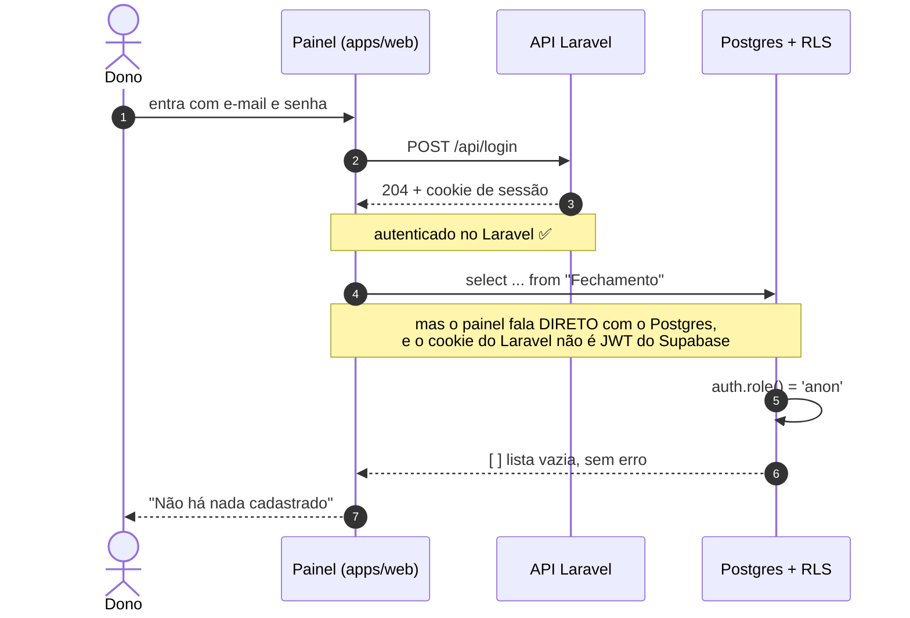
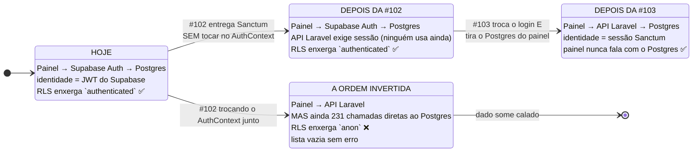
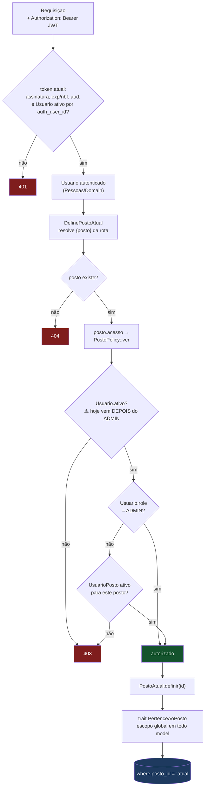
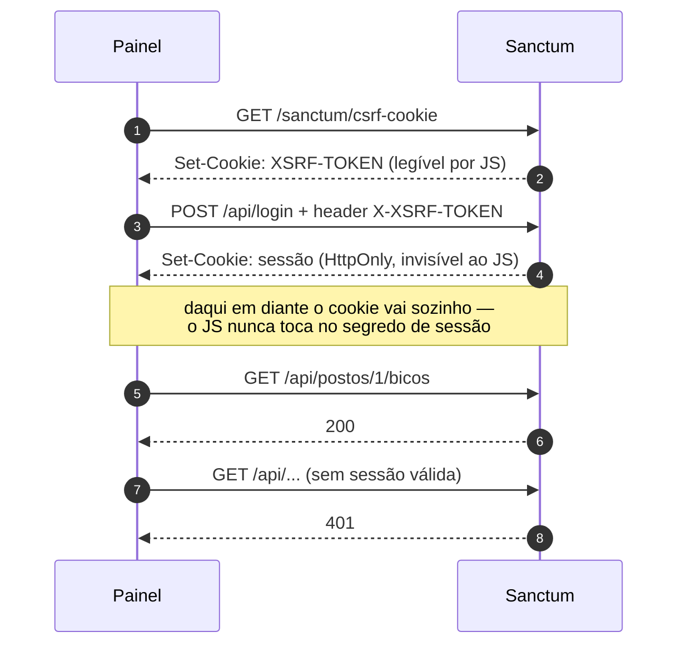

# Autenticação do painel — Design Doc

Issue: #102 (mãe: #60) · Estado: **parcialmente implementado — o guard da transição está no código (20/09/2026, commit `465efd5`, §3b); pendências do dono seguem: instalar Sanctum, escolher o SMTP e migrar os 16 usuários** · Data: 17/09/2026 · Atualizado: 20/09/2026 (o guard entrou — §3b; a DECISÃO 1 de 18/09, que fez a #102 exigir identidade aceitando o token do login atual, segue valendo no §3)

> Chave de abóbada da Fase A: destrava #101, #103 e #104. É também a issue onde `UsuarioPosto`,
> `Usuario.role` e a `PostoPolicy` da #97 finalmente passam a valer.
> Fonte do levantamento: `.claude/agent-memory/grafo/superficie-autenticacao-web.md` (17/09).
> Diagramas Mermaid (CLAUDE.md §3) acrescentados em 18/09 — o texto do desenho original foi preservado.

## 1. Contexto — hoje logar no painel *remove* trava

Não é força de expressão. As policies de RLS dão mais permissão a `authenticated` do que a `anon`, e
**nenhuma regra viva consulta `UsuarioPosto` ou `Usuario.role`**. O efeito prático: autenticar hoje é
elevação de privilégio sem escopo nenhum. Qualquer um dos 16 usuários enxerga qualquer posto.

A #97 já construiu o remédio — `PertenceAoPosto`, `PostoAtual`, `PostoPolicy` — mas deixou tudo sem
dente, porque não havia usuário autenticado. Esta issue é onde os dentes nascem.

## 2. Subsistema

`App\Pessoas` (já existe desde a #97) ganha o guard de identidade e o registro das Policies nas rotas.

O que ele ganhou de fato, em 20/09/2026 e nessa ordem: `Application\VerificaTokenDoSupabase` e
`Http\Middleware\{AutenticaPeloTokenAtual, ExigeAcessoAoPosto}` — o guard por **Bearer token**, descrito
no §3b. O `AutenticacaoController` e o Sanctum em modo SPA (cookie de sessão, não token) entram depois,
como **segundo emissor** (§5). Os dois convivem: o middleware de identidade é o mesmo, muda quem assina
o token.

## 3. ⚠️ O problema central: sessão Laravel não é JWT do Supabase

**Este é o achado que reordena a issue.**

As policies de RLS distinguem `anon` de `authenticated` chamando `auth.role()` — **24 das 103
policies** do esquema fazem isso. Uma sessão Laravel não produz JWT do Supabase. Logo:

> Enquanto o painel continuar falando direto com o Postgres, **um usuário logado no Laravel é `anon`
> no banco.**

#### A janela `anon`, passo a passo

O perigo não é o login falhar — é ele **dar certo** e o banco não saber disso:



O passo 8 é o problema inteiro: a RLS **não devolve erro**, devolve vazio. O painel não tem como
distinguir "não existe" de "não pode ver", e mostra a frase errada com a cara de normalidade.

Já aconteceu aqui, com esta assinatura exata — *"Reset do painel apaga em silêncio: roda como `anon`,
a RLS engole o erro, o app reporta sucesso com zeros."*

#### Onde mora a identidade, em cada fase



A leitura: o painel só pode trocar de identidade **no mesmo movimento** em que para de falar com o
Postgres. Qualquer estado intermediário é o `X`.


E este repositório já tem cicatriz exata desse modo de falha: *"Reset do painel apaga em silêncio —
roda como `anon`, a RLS engole o erro, o app reporta sucesso com zeros."* Repetir isso agora seria
perder dado de produção com o sistema "funcionando".

### DECISÃO 1 — a #102 **não** troca o `AuthContext`. Essa tarefa muda para a #103.

A issue lista "`AuthContext.tsx` troca `supabase.auth.*` por `/api/login`". Se isso entrar na #102,
abre-se uma janela — entre a #102 e a #103 — em que o painel está autenticado no Laravel e `anon` no
Postgres, e ainda fala direto com o Postgres em 231 chamadas. É a janela onde o dado some calado.

Sessão dupla não resolve: a migração de senha (§4) faz a senha do Laravel **divergir** da do
Supabase, então não dá para logar nos dois com a mesma credencial.

**Escopo corrigido:**

| Issue | Entrega |
|---|---|
| **#102** | **Entregue em 20/09 (`465efd5`):** guard por Bearer (o token do login atual) e `PostoPolicy` com dente — ver §3b. **Ainda não entregue:** Sanctum como segundo emissor, migração dos 16 usuários, e pendurar o guard nas rotas do catálogo, que **seguem públicas**. O painel continua logando no Supabase. |
| **#103** | O painel para de falar com o Postgres **e** troca o emissor do token na mesma entrega. Nunca há um momento `anon`. |

Custo: a #102 deixa de ter efeito visível no painel. Ganho: não existe janela de perda silenciosa.
Isso precisa ser corrigido no texto das duas issues.

> **Correção de 18/09/2026 (decisão do dono, registrada em `fechamento-diario-api.md` §6, DECISÃO A).**
> A linha da #102 acima dizia "toda rota da API exigindo **sessão**" (Sanctum). Combinada com a
> DECISÃO 2 da `painel-pela-api.md` — o `AuthContext` só troca no fim da #103 —, isso fazia toda
> fatia migrada do painel receber 401 entre a #102 e o fim da #103, inclusive o piloto de
> fornecedor (#121). **O que passa a valer:** o guard da #102 **aceita o token do login atual**
> (o JWT que o Supabase Auth já emite para o painel) e resolve o `Usuario` por
> `Usuario.auth_user_id` (`01-esquema-base.sql:510`); toda rota fica protegida desde já, inclusive
> escrita; a `PostoPolicy` ganha dente com esse usuário. Sanctum e `POST /api/login` (§5) entram
> como **segundo emissor**, sem exigir que o painel troque de login. Trocar o login depois é só
> trocar quem emite o token. A janela `anon` do §3 continua proibida: o painel segue logando no
> Supabase até a última chamada direta ao Postgres sair.

## 3b. O guard implementado (20/09/2026, commit `465efd5`)

A DECISÃO A saiu do papel. São **três peças**, e só uma delas tem prazo de validade:

| Peça | Responsabilidade | Sobrevive ao Sanctum? |
|---|---|---|
| `App\Pessoas\Application\VerificaTokenDoSupabase` | confere o JWT HS256 do Supabase e devolve o `sub`; puro, sem HTTP nem Eloquent | ❌ **não** — é a única peça descartável |
| `App\Pessoas\Http\Middleware\AutenticaPeloTokenAtual` | lê o `Authorization: Bearer`, manda verificar e resolve o `sub` para `Usuario.auth_user_id`, **só se ativo**; 401 em qualquer falha | ✅ sim |
| `App\Pessoas\Http\Middleware\ExigeAcessoAoPosto` | aplica a `PostoPolicy` sobre o posto já resolvido; 403 sem vínculo | ✅ sim |

Os aliases estão em `backend/bootstrap/app.php:21-24`: `token.atual` diz **quem é**, `posto.acesso` diz
se pode ver **este** posto. A ordem na rota é obrigatória:

```
->middleware(['token.atual', DefinePostoAtual::class, 'posto.acesso'])
```

`token.atual` primeiro porque a policy precisa de um usuário; `DefinePostoAtual` no meio porque a policy
precisa do **posto resolvido**. Guard fora de ordem é **500**, não 403 — erro de configuração de rota
não se disfarça de negativa de acesso.

### JWT sem biblioteca, e por quê

Nenhuma dependência nova entrou no `composer.json`: `hash_hmac` e `hash_equals` do PHP bastam para
HS256. Três decisões de segurança que isso obrigou a tomar à mão:

- **O `alg` é conferido ANTES da assinatura.** Defesa contra confusão de algoritmo, testada com
  `alg: none` e com `RS256` — um token que troca o algoritmo é recusado antes de qualquer comparação.
- **`hash_equals`, tempo constante.** Comparação de assinatura não vaza o prefixo certo pelo relógio.
- **Falha fechada com segredo vazio.** Sem `SUPABASE_JWT_SECRET`, o verificador nasce com segredo vazio
  e recusa **todo** token. O binding no `AppServiceProvider` **estreita** o valor de `config()` em vez de
  castá-lo: `(string) mixed` transformaria um array mal configurado no literal `"Array"`, que é um
  segredo válido — e o sistema abriria em vez de fechar.

### Por que `ExigeAcessoAoPosto` lê os atributos da requisição

Ele não busca o model do posto no container. Ler `Posto` exigiria conhecer `App\Cadastro`, e **nenhum
módulo depende de outro** (CA-7, sem exceção, decisão do dono de 18/09). Então o middleware trabalha com
o que `DefinePostoAtual` já deixou na requisição.

### Quais rotas já usam o guard (atualizado em 22/09)

No grupo protegido de `routes/api.php:77-99`: `leituras`, `sessoes` e `GET fechamento` (P5–P7, habilidade
`ver`), e `PUT fechamento` (P11) e `GET dashboard` (#103, 22/09) com `posto.acesso:gerir`. O catálogo segue
**público** no grupo de `routes/api.php:50-60`. A pendência registrada em `cadastro.md` — pendurar a
`PostoPolicy` nas rotas do catálogo — **continua aberta**, e é fatia própria.

### Lado do cliente: existe desde a P5

Desde `5897f1c` (#103 P5), `frontend/apps/web/src/services/api/base.ts:87-89` manda
`Authorization: Bearer <access_token>` quando há sessão do Supabase, e só `Accept` quando não há — a
requisição sem sessão leva 401 na rota protegida, sem fallback.

> **Condição de saída da ponte.**
> **Morre:** `VerificaTokenDoSupabase`, `config/supabase.php`, `SUPABASE_JWT_SECRET` e
> `tests/Unit/VerificaTokenDoSupabaseTest.php`.
> **Fica:** `AutenticaPeloTokenAtual`, `ExigeAcessoAoPosto`, a `PostoPolicy`, os aliases e a ordem na
> rota.
> **Como se sabe que chegou a hora:** `rg "supabase\.auth" frontend/apps/web/src` volta vazio.
> **Regra enquanto isso:** acrescentar capacidade ao verificador é **dívida**. Capacidade nova vai no par
> de middlewares, que é o que sobrevive.

### O que falta para a #102 fechar

| Item | Estado |
|---|---|
| Guard de identidade + policy com dente | ✅ feito (20/09, `465efd5`) |
| Pendurar o guard no catálogo (`routes/api.php:50-60`) | ❌ — fatia própria (ver `cadastro.md`) |
| Pendurar o guard no dashboard | ✅ feito (22/09, #103, `posto.acesso:gerir`) |
| `base.ts` enviar `Authorization` | ✅ feito (`5897f1c`, #103 P5) |
| Sanctum como segundo emissor | ❌ — depende do "ok" do dono para o `composer.json` |
| Migração dos 16 usuários | ❌ — depende do SMTP |
| ADMIN inativo → 403 na policy | ❌ **NÃO CORRIGIDO** — ver §4 |
| Apagar `App\Models\User` | ❌ |


## 4. Comportamento

### Migração dos 16 usuários — é um evento operacional, não um `INSERT`

O hash de senha do Supabase **não é migrável**. Os 16 usuários (você inclusive) recebem link de
redefinição. Consequências que precisam estar combinadas antes, não durante:

- É preciso **SMTP no `.env` do backend**. Hoje quem manda e-mail é o SMTP embutido do Supabase, que
  vai embora no cutover. **Pendência sua:** qual provedor. É custo recorrente novo, ainda que baixo.
- Se o e-mail não sair, ninguém entra no painel. O `php artisan` precisa de um caminho de
  redefinição manual para o primeiro ADMIN, senão um SMTP mal configurado tranca todo mundo do lado
  de fora — o mesmo cuidado do sudoers.
- `Usuario` já tem o e-mail, então o casamento é por e-mail. Conferir duplicata e e-mail vazio
  **antes** de migrar, não depois.
- 🪤 **O trigger `handle_new_user()` cria `Usuario` sozinho, e é armadilha na migração.**
  `banco/init/01-esquema-base.sql:1615` põe `on_auth_user_created AFTER INSERT ON auth.users` a executar
  `handle_new_user()` (`:1311`), que (a) auto-confirma o e-mail, (b) deriva o nome de
  `split_part(NEW.email,'@',1)` e (c) **INSERE em `public."Usuario"` com `role='FRENTISTA'`**, ignorando
  o papel que o usuário deveria ter. Consequências, descobertas ao testar o guard: inserir em
  `auth.users` **sem e-mail quebra o trigger** (`Usuario.email` é `NOT NULL`); todo usuário criado por
  esse caminho nasce `FRENTISTA`, e é `Usuario.role` que a `PostoPolicy` lê; quem migrar os 16 precisa
  decidir **antes** entre desativar o trigger e inserir à mão, ou deixá-lo criar e corrigir o `role`
  depois (janela com papel errado); e o trigger vive no esquema `auth`, que **não existe** no Postgres do
  cutover — é parte do que o cutover apaga, não do que migra.

### Papéis ganham dente

`Role` (`ADMIN`, `GERENTE`, `OPERADOR`, `FRENTISTA`) e `UsuarioPosto` passam a decidir de verdade,
via a `PostoPolicy` que a #97 já escreveu e registrou no Gate. O aceite da issue é bom e fica:
**usuário sem `UsuarioPosto` não vê nada.** Teste explícito para isso.

A cadeia completa, do token ao `where posto_id = ?`:



O Sanctum entra depois como **segundo emissor no mesmo nó de entrada**, sem mudar nada do resto da
cadeia — e é exatamente esse o argumento da condição de saída do §3b: muda quem assina o token, não como
identidade vira autorização.

Três coisas que o desenho deixa explícitas e o texto não:

- **⚠️ `ADMIN` inativo — mitigado pelo middleware, NÃO corrigido na policy.** O commit `465efd5` não
  tocou `PostoPolicy.php`. A policy continua devolvendo `true` para `ADMIN` **antes** de olhar `ativo`,
  que só é conferido dentro de `vinculoAtivo()`, no ramo de quem não é ADMIN. O que mudou em 20/09: o
  guard filtra `->where('ativo', true)` **antes** da policy, então um ADMIN desativado leva **401 no
  primeiro portão** e nunca chega a ela. A mitigação é real e testada, mas é defesa em **um ponto só**:
  a policy segue errada para qualquer chamador que não passe pelo middleware — um job, um Command, ou um
  segundo emissor. O teste "ADMIN inativo → 403" **continua não existindo**. Tarefa aberta: conferir
  `Usuario.ativo` antes do ramo ADMIN, nos dois métodos.

- **`gerir` não aparece aqui.** O fluxo acima é o de leitura (`ver`). A escrita exige `gerir`, que
  além do vínculo ativo cobra `UsuarioPosto.role` ∈ {`admin`, `gerente`}. Como a #102 não entrega
  endpoint de escrita, esse ramo nasce testado e sem uso — de propósito.
- **O escopo por posto é a última linha de defesa, não a primeira.** Mesmo que a policy passasse por
  engano, o trait ainda corta o `select` no posto atual. É a defesa em profundidade que a RLS
  sozinha nunca deu.


### O portão do frontend é um componente só

Não existe rota protegida no painel: o gate é o `PortaDeEntrada` no `App.tsx`, que só monta o
`<BrowserRouter>` quando autenticado. Nenhum `ProtectedRoute`, nenhum `Navigate` para `/login`.

Isso é bom para a troca (um ponto só) e ruim como padrão: **rota nova nasce desprotegida por
omissão**. Não é escopo desta issue mudar, mas fica registrado — quando a #103 mexer no roteamento, é
a hora de plantar proteção por rota.

## 5. Contratos

```
POST /api/login            { email, senha }        → 204 + cookie de sessão
POST /api/logout                                   → 204
GET  /api/me                                       → { id, nome, email, role, postos: [...] }
POST /api/senha/esquecida  { email }               → 202 (sempre 202, nunca revela se o e-mail existe)
POST /api/senha/redefinir  { token, senha }        → 204
```

Sanctum em **modo SPA**: cookie `HttpOnly` + CSRF, não Bearer token. O painel é first-party no mesmo
domínio; token em `localStorage` seria XSS esperando acontecer.



O `HttpOnly` é o ponto: um XSS no painel consegue ler o `XSRF-TOKEN`, mas **não** o cookie de sessão.
Com Bearer em `localStorage`, o mesmo XSS levaria a credencial inteira embora.

> **Tensão a assumir, não a esconder.** O argumento acima — "token em `localStorage` seria XSS esperando
> acontecer" — continua valendo para o **alvo**. Mas o guard da transição (§3b) aceita exatamente um
> Bearer que o `supabase-js` guarda no `localStorage` do painel. Durante a ponte a superfície de XSS
> **não muda** (o token já estava lá e já valia no PostgREST com RLS), mas também **não melhora**. É mais
> um motivo para a condição de saída ter **data**, e não "quando der".


Toda rota da API passa a exigir identidade — **exceto** as do PWA do frentista, que são issue própria

> ⚠️ **Estado em 22/09:** isto descreve o ALVO, não o que roda. Leituras, sessões, fechamento e
> dashboard já estão atrás do guard (§3b), e o painel manda `Authorization` desde a P5 (`base.ts`);
> o catálogo da #97 segue público (`backend/routes/api.php:50-60`), fatia própria.
(#101). Até lá elas seguem públicas, como já estão.

## Testes

Auth hoje tem **cobertura zero** (`rg -l "AuthProvider|useAuth|TelaLogin" -g '*.test.*'` volta
vazio). Não há rede de segurança herdada; tudo nasce aqui.

- Login válido, inválido, usuário inativo.
- **Usuário sem `UsuarioPosto` não vê nada** — o aceite da issue, como teste.
- **`ADMIN` inativo → 403** em `ver` e em `gerir` — falha contra a `PostoPolicy` da #97; é o teste
  que prova a correção da ordem (ver "Papéis ganham dente").
- `OPERADOR` não faz o que `GERENTE` faz; `ADMIN` atravessa; usuário do posto A não lê o posto B
  (reaproveita o teste de escopo da #97, agora com usuário de verdade).
- Rota sem sessão → 401. Rota do PWA frentista → segue acessível.
- `POST /api/senha/esquecida` devolve **202 para e-mail inexistente também** — não vazar quem existe.
- `Mail::fake()`; nenhum e-mail real no CI.

## Riscos e decisões em aberto

- 📦 **Sanctum precisa do seu ok** para entrar no `composer.json` (a issue já marca).
- 📮 **SMTP é decisão sua** — provedor e custo. Sem ele, a migração de senha não acontece.
- ⚠️ **Ordem #102 → #103 é obrigatória e acoplada.** Se alguém entregar a #102 com a troca do
  `AuthContext` junto, cria-se a janela `anon`. Está na DECISÃO 1 e precisa ir para o texto das issues.
- ⚠️ **As 24 policies com `auth.role()` continuam de pé** até o cutover (#105). Elas não atrapalham
  enquanto o painel seguir usando Supabase Auth — mas são exatamente o que quebra se a ordem inverter.
  Levantar a lista exata com o agente `rls` antes de abrir a branch.
- As policies que usam `Usuario.auth_user_id = auth.uid()` são só as de `PushToken`, e esse é
  caminho morto (o serviço só é re-exportado pelo barril, sem chamador). Não pesa na decisão.
- 🪤 **O trigger `handle_new_user()` decide o `role` por você** (`01-esquema-base.sql:1311`, `:1615`):
  todo usuário criado via `auth.users` nasce `FRENTISTA`. O caminho da migração — desativar o trigger, ou
  deixá-lo criar e corrigir depois — precisa ser escolhido **antes** de migrar, não durante (§4).
- ⏳ **A ponte precisa de prazo, não só de condição.** `VerificaTokenDoSupabase` tem condição de saída
  escrita (§3b) e **nenhuma data**. Ponte sem prazo vira arquitetura — e esta tem um único arquivo para
  apagar, o que a torna barata de cumprir e fácil de esquecer.
