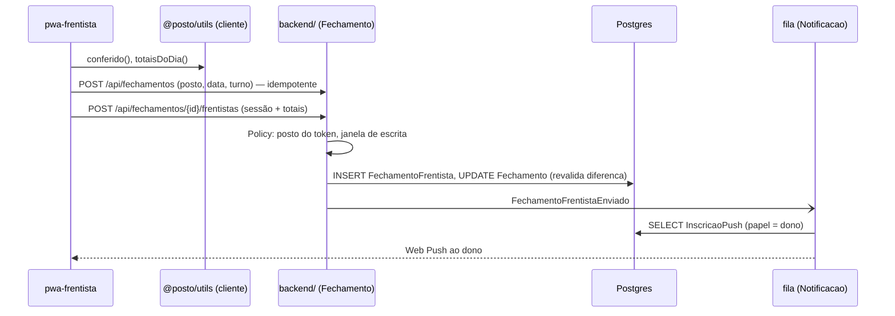

# Fase A — backend Laravel · Design Doc

Issue: #94 (mãe: #60) · Estado: **aprovado** (dono, 17/09/2026) · Data: 17/09/2026 · Autor: sessão com o dono

> Portão do `CLAUDE.md` §1: nenhuma issue filha abre branch antes deste doc estar **aprovado**.
> Base factual: `.claude/docs/mapa-do-sistema-17-09-2026.md` (6 varreduras + catálogo vivo).
> As seções marcadas **DECISÃO** precisam do dono; o resto é constatação.

## 1. Contexto — o que muda para quem está fora

| Conexão externa | Hoje | Depois da Fase A |
|---|---|---|
| Frentista (PWA) | PostgREST com anon key, 15 chamadas, sem login | `backend/` via HTTPS, token de aparelho |
| Dono (PWA) | PostgREST anon + Edge `ler-encerrante` + Web Push | `backend/`: `/api/encerrante/ocr`, `/api/push/*` |
| Gerente (painel) | PostgREST + Supabase Auth (e-mail/senha PKCE), 231 chamadas | `backend/` com sessão (Sanctum) |
| Google Gemini | chamado pela Edge Function | chamado pelo backend (`Http::pool`, 2 temperaturas) |
| Web Push (VAPID) | Edge `notifica-dono` com `service_role` | job em fila no backend |
| Vercel | 3 sites estáticos | 3 sites estáticos + `VITE_API_URL` |
| Supabase | banco, auth, RLS, realtime, edge | **desligado no cutover (#105)** |
| Planilha / ETL (`scripts/*.py`) | Management API | `psql` direto no Postgres próprio |

O que **não** muda: as três telas, `frontend/packages/utils` (fórmulas, 18 golden), o esquema do banco
(`banco/init/01-esquema-base.sql` é o contrato de dados).

## 2. Subsistemas — monólito modular em `backend/`

```
backend/app/
  Cadastro/      Combustivel, Tanque, Bomba, Bico, Turno, Frentista, FormaPagamento, Maquininha, Fornecedor
  Fechamento/    Fechamento, FechamentoFrentista, Recebimento, Leitura, janela de escrita, auditoria
  Financeiro/    Despesa, Receita, CategoriaFinanceira, Compra, custo do mês
  Estoque/       Estoque, HistoricoTanque, Produto, VendaProduto, MovimentacaoEstoque
  Pessoas/       Usuario, UsuarioPosto, Role, Escala, PresencaFrentista, Cliente, NotaFrentista
  Notificacao/   InscricaoPush, job NotificarDonoDoEnvio
  Ocr/           cliente Gemini, rate limit, contrato { leituras: [{bico, numero, confianca}] }
  Compartilhado/ Posto (raiz do tenant), PostoAtual, PertenceAoPosto, Enums, Dinheiro (decimal), DTOs base
```

**Regra de dependência (Deptrac, escrita antes do primeiro controller):**
`Http` → `Application` (Commands/Queries) → `Domain` (Models, Services) → `Compartilhado`.
Módulos só se falam por `Application`; `Fechamento` pode depender de `Cadastro`; ninguém depende de
`Fechamento` exceto `Notificacao`. Ciclo = PR rejeitado (§3 do CLAUDE.md).

**Sem exceção.** Decisão do dono em 18/09/2026: esta regra não se afrouxa. Hoje não há nenhuma
dependência entre módulos: `Posto` mora em `App\Compartilhado` (raiz do tenant, ao lado de
`PostoAtual` e `PertenceAoPosto`), resolvido em `refactor/cadastro-sem-ciclo` (18/09), a mesma
branch que desfez o ciclo `Cadastro ↔ Pessoas`. `Pessoas\Domain\Usuario`, `UsuarioPosto` e os nove
models de Cadastro apontam para `App\Compartilhado\Posto`; `Domain → Compartilhado` já era
permitido, e nenhum módulo depende do `Domain` de outro. O mapa `direcaoPermitidaEntreModulos()`
está vazio (`[Cadastro => [], Pessoas => []]`); a linha "`Fechamento` pode depender de `Cadastro`"
acima entra no mapa quando o módulo nascer, restrita a `App\Fechamento → App\Cadastro\Application`.
O Deptrac não enxerga dependência entre módulos na mesma camada; quem trava é o Pest Arch em
`backend/tests/Arch/ArquiteturaTest.php`, que também proíbe `App\Compartilhado` de usar módulo.

### Ordem de entrega (strangler; cada passo deixa o sistema funcionando)

1. #95 raiz · #96 backend vazio no compose · #97 models de cadastro (só leitura)
2. #98 OCR · #99 push · #100 agregações — fronteira pequena, mata a fórmula em plpgsql
3. #101 fechamento do frentista · #102 auth do painel
4. #103 painel módulo a módulo · #104 realtime
5. #105 cutover · #106 regras

## 3. Componentes — DECISÕES

### DECISÃO 1 — raiz do repo (#95)

| | A. `frontend/` + `backend/` | B. só `backend/`, TS fica onde está |
|---|---|---|
| Raiz | limpa: 2 pastas de código + `banco/`, `docs/`, `scripts/`, compose | mistura config TS (`vite.config.ts`, `tsconfig.json`, `turbo.json`…) com o resto |
| Custo | `git mv` de 435 arquivos + 12 configs (vercel, CI, tsconfig, hooks, skills, ativos-críticos) | zero |
| Risco | um commit só, tag antes, preview dos 3 apps depois | nenhum |
| Blame | `git blame` segue rename; `git log --follow` também | intacto |

**Recomendação: A**, feita como o primeiro PR da sprint, antes de existir `backend/`, num commit
só de movimento. É o que o dono pediu ("organizar a raiz, front do backend") e é mais barato
agora do que com Laravel no meio. **Aprovado (A) em 17/09.**

### DECISÃO 2 — onde `totaisDoDia` roda (#101)

Hoje a consolidação do fechamento do dia (`frontend/packages/api-core/src/encerrante.ts:551-655`) roda
**no cliente**: soma `Leitura.valor_total`, chama `totaisDoDia(sessões)` de `frontend/packages/utils` e
grava `total_vendas/total_recebido/diferenca` no `Fechamento`.

| | A. continua no cliente (TS) | B. vai para o servidor (PHP) |
|---|---|---|
| Fórmula | intocada, 18 golden valem | `FechamentoService` em PHP, golden **portado para Pest antes** |
| Confiança | servidor grava o que o cliente mandou | servidor é a autoridade |
| Escopo | Fase A pura (#60: "A e B não podem ser feitas juntas") | é a Fase B, issue própria |
| Duplicação | nenhuma | duas implementações da mesma fórmula até o front parar de calcular |

**Aprovado (A) em 17/09.** Recomendação: A na Fase A. O endpoint `POST /api/fechamentos/{id}/consolidar` recebe os
totais calculados e **revalida** só o invariante barato (`diferenca = total_vendas −
total_recebido`, em centavos). Fase B decide se a autoridade muda de lado.

### DECISÃO 3 — fila e carga

Redis + fila **só** para `Notificacao` (push) e `Ocr` (Gemini, 2 chamadas). Escrita de
fechamento é síncrona: 12 frentistas, um posto, e "um VPS caído às 22h é um posto que não fecha o
caixa" (#60) — fila no caminho de escrita adiciona um ponto de falha sem ganho. Locust só no
cutover (#105), meta "12 frentistas fechando no mesmo minuto". **Aprovado em 17/09.**

### DECISÃO 4 — identidade do frentista no PWA (#101)

Hoje: anon key + frentista escolhido em `localStorage`. Opções: (a) token de aparelho emitido
pelo gerente no painel (QR), guardado no PWA; (b) PIN por frentista. **Aprovado (a) em 17/09.** Recomendação: (a), porque
não muda a tela do frentista (decisão de 17/09) e dá ao backend um `posto_id` confiável.

### DECISÃO 5 — um posto por instalação, e a porta do banco compartilhado fica aberta

Dito pelo dono em 17/09: **mesmo código e mesma lógica, instalado no Posto Providência e em
outros postos separados** — o modelo anterior (um projeto Supabase montado à mão por cliente)
não escala. Se um dia um banco compartilhado (multi-tenant) vai existir, **"ainda não sei,
talvez sim"**. O desenho, portanto:

- **Padrão de entrega:** uma instalação por posto = `docker compose up` (Postgres + api) + seed do
  posto (`banco/dados/`, gerado por script a partir do cadastro levantado com o dono). Dentro de
  cada instalação o posto é `posto_id = 1`, como hoje; golden e ETL não mudam. A #93 vira
  "instalador do posto novo", não "segundo projeto Supabase".
- **Porta aberta, barata agora e cara depois:** `posto_id NOT NULL` em toda tabela de domínio
  (medido em 17/09: 31 de 45 têm a coluna, só 4 como NOT NULL; 4 sem FK; `AuditoriaDados` e
  `InscricaoPush` sem a coluna) e o escopo global `PertenceAoPosto` em todo model. Com isso, ligar
  vários postos no mesmo banco vira configuração + token, não migração de esquema.
- **O que NÃO se faz enquanto a decisão estiver aberta:** schema por tenant, resolução de tenant
  por subdomínio, billing. **Em aberto; revisitar no cutover (#105).**

### Componentes fixos (não são decisão)

- Models Eloquent sobre as tabelas existentes, `$table = '"Fechamento"'` etc.; dinheiro `numeric`
  com cast `decimal:2` (`(15,3)` em litros). Enums PHP `Role`, `StatusFechamento` espelham os do banco.
- Concern `PertenceAoPosto`: global scope por `posto_id`. É o filtro que a RLS **nunca teve**.
- Auth: Sanctum (cookie) para o painel; token de aparelho para PWAs. `UsuarioPosto` + `Role`
  passam a valer nas Policies.
- Janela de escrita/edição (`dentro_da_janela_de_*`, hoje policy SQL) vira regra de aplicação,
  com a mesma semântica (7 dias / mês anterior; replay = configuração, não DDL).
- Auditoria: os triggers `audita_*` **ficam no Postgres** (portáveis, já testados no compose).
- Unique `(fechamento_id, frentista_id)` em `FechamentoFrentista`: escrito em 19/08, nunca
  aplicado; entra como primeira migration do Laravel.

## 4. Comportamento — fechamento do dia (alvo)



Assíncrono: só o push e o OCR. Tudo o mais responde na requisição.

## 5. Contratos

- **Dados:** `banco/init/01-esquema-base.sql` (45 tabelas). Nenhuma coluna nova nesta fase.
- **HTTP:** JSON, `snake_case` igual ao banco (o Data Mapper para camelCase continua na fronteira
  TS, como hoje). Erros no formato `{ erro: { codigo, mensagem, campos? } }`.
- **Form Requests** por endpoint; DTOs tipados; dinheiro trafega como string decimal (`"1234.56"`),
  nunca float, e o TS quantiza com `emCentavos` na entrada.
- **Contratos que não podem mudar de forma** (para `api-core` e os PWAs não mudarem de tela):
  OCR `{ imagemBase64, mimeType } → { leituras: [{bico, numero, confianca}] }`; inscrição push
  `{ endpoint, p256dh, auth, papel, descricao_aparelho }`.
- **Endpoints por issue:** #97 `GET /api/postos/{id}/{combustiveis,tanques,bombas,bicos,turnos,frentistas,formas-pagamento}`;
  #98 `POST /api/encerrante/ocr`; #99 `POST /api/push/inscricoes`, `POST /api/fechamentos-frentista/{id}/avisar-dono`;
  #100 `GET /api/postos/{id}/dashboard`, `.../fechamento-mensal/{ano}/{mes}`, `GET /api/frentistas?com_email`;
  #101 `POST/PUT/DELETE /api/fechamentos*`, `/api/historico-tanque`, `/api/presenca`, `/api/vendas-produto`;
  #102 `/api/login`, `/api/logout`, `/api/me`, `/api/senha/*`.

## Testes

- **Dinheiro:** `bun run test:golden` continua o juiz (18 arquivos, 3.296 asserções). Endpoint de
  agregação (#100) é testado por igualdade com a RPC nos 7 meses de `docs/data/posto_jorro_2026.sqlite`.
- **Backend:** Pest ≥ 85 % (§6), contra o Postgres do compose com `banco/dados/cadastros.sql`.
- **Arquitetura:** Deptrac no CI; PHPMD CCN ≤ 10; PHPStan.
- **Ponta a ponta:** por issue, skill `validar-feature-posto-providencia` em `localhost:3015/3016/3017`.

## Riscos e decisões em aberto

- Regra traduzida errado da RLS/RPC para PHP **não dá erro** (#60). Mitigação: #100 por igualdade
  numérica; janela de escrita com teste de fronteira (dia −7, dia +2).
- Duas divergências de domínio já abertas (denominador do preço médio; taxa por transação ×
  despesa do mês, mapa §7) **não entram** nesta fase: congelam como estão, com issue própria depois.
- #60 e #93 competem pelas mesmas semanas; #93 está em espera até contrato.
- Dependências novas (`laravel/boost`, `minishlink/web-push`, Sanctum, Redis) — cada uma pede ok.
- Assinatura Max acaba em 20/09: o fluxo `ultracode`/workflows precisa ser calibrado ao modelo
  que ficar.

## Aprovação

- [x] DECISÃO 1 (raiz: A) · [x] DECISÃO 2 (`totaisDoDia`: A) · [x] DECISÃO 3 (fila só push/OCR) · [x] DECISÃO 4 (token de aparelho)
- [~] DECISÃO 5 (instalação por posto; banco compartilhado em aberto — "talvez sim") — registrada em 17/09, não fecha
- [x] Dono marcou este doc como **aprovado** em 17/09/2026 → #95 abre branch.
