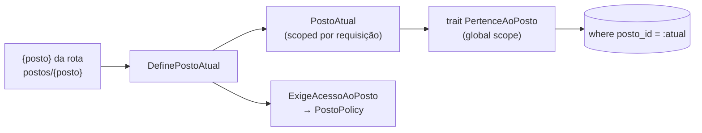

# Multi-tenant — Design Doc

Issue: #93 (redefinida) · mãe: #60 · Estado: **rascunho — PRECISA de decisão do dono sobre o conflito
com a DECISÃO 5 da `fase-a-laravel.md` e com o texto atual da #93** · Data: 20/09/2026

> Rumo declarado pelo dono em 20/09/2026: **multi-tenant é o destino da refatoração, não uma porta
> aberta** (ver `docs/architecture.md` §2). Este doc é o dono transversal da regra de escopo; as regras
> em si vivem em `docs/arquitetura/regras.md`, família **TEN**.

## 1. Contexto — o que muda para quem está fora

Hoje o sistema serve **um posto**. O alvo é **N postos no mesmo backend**, cada um um tenant.

O que um cliente **não pode** ver do outro: leitura, fechamento, recebimento, compra, despesa, estoque,
frentista, bico, preço — tudo que carrega `posto_id`.

O modo de falha importa mais que a regra: **se o escopo falhar, o dado aparece; não dá erro.** É a
mesma assinatura da RLS — *"roda como `anon`, a RLS engole o erro, o app reporta sucesso com zeros"*.
Com um posto só isso é invisível. Com dois, é o dado de um cliente na tela do outro.

## 2. Subsistema — onde o tenant é resolvido

Quem **escopa**: `DefinePostoAtual` → `PostoAtual` → `PertenceAoPosto`.
Quem **autoriza**: a `PostoPolicy`, aplicada pelo middleware `ExigeAcessoAoPosto` (#102).

**DECISÃO EM ABERTO — onde o dado de cada tenant mora:** banco compartilhado × banco por posto ×
schema por tenant. A DECISÃO 5 da `fase-a-laravel.md` escolheu **"uma instalação por posto"**; o rumo de
20/09 pede revisão dessa escolha. **Não decidir aqui.**

## 3. Componentes

**Existe hoje:**

| Peça | Onde |
|---|---|
| `Posto` | `App\Compartilhado\Posto` |
| `PertenceAoPosto` (global scope) | `App\Compartilhado\PertenceAoPosto` |
| `PostoAtual` (scoped por requisição) | `App\Compartilhado\PostoAtual` |
| `DefinePostoAtual` (middleware) | backend, grupo `postos/{posto}` |
| `UsuarioPosto` (vínculo) | `App\Pessoas\Domain` |
| `PostoPolicy` | `App\Pessoas` |
| Guard da #102 (`token.atual`, `posto.acesso`) | `App\Pessoas\Http\Middleware` |
| Gate de escopo | `backend/tests/Feature/Arquitetura/EscopoDeTenantTest.php` |

**Falta:**

- `posto_id NOT NULL` + FK onde não tem (**TEN-4**);
- uniques com `posto_id` (**TEN-5**);
- **escopo em Job e em Command**: `PostoAtual` é scoped por requisição — quem define o posto numa fila?
- seed de posto novo (criar um tenant do zero, reprodutível);
- `AuditoriaDados` e `InscricaoPush`, que **não têm** a coluna `posto_id`.

## 4. Comportamento

O que atravessa tenants **de propósito**:

| Quem | Por quê |
|---|---|
| `Usuario` | a mesma pessoa pode trabalhar em mais de um posto |
| `UsuarioPosto` | é a tabela que **decide** o acesso; escopá-la pelo posto atual seria circular (exceção TEN-2) |
| ADMIN global | atravessa por papel, não por vínculo |

E o caminho inverso, que ninguém costuma desenhar: **como um posto some.** Desativação (o tenant para de
ser servido sem o dado sumir) e exportação do dado (o cliente leva o que é dele ao sair). Sem isso
escrito, "sair do sistema" vira `DELETE` manual.

## 5. Contratos

Hoje o tenant vem **no caminho**: `postos/{posto}`. Alternativas a registrar com o porquê da recusa —
subdomínio (`posto-a.exemplo.com`), header (`X-Posto-Id`) e claim no token. **Decidir antes da primeira
rota de escrita multi-posto**, porque trocar depois muda toda URL publicada.

## Testes

O gate **TEN** cobre o **código**: model em tabela com `posto_id` usa o trait, exceção precisa de motivo,
model sem a coluna declara como é escopado.

Falta o **teste de vazamento ponta a ponta**: usuário do posto A pede dado do posto B **em cada rota** e
recebe 403 ou vazio. É a régua que a RLS nunca teve — e é ela que prova que o escopo funciona, não que
ele está escrito.

## Riscos e decisões em aberto

- ⚠️ **Conflito não resolvido:** a DECISÃO 5 da `fase-a-laravel.md` e o texto atual da #93 dizem "uma
  instalação por posto, banco compartilhado ainda não sei, talvez sim"; `docs/design/cutover.md` já
  registra que a #93 "muda de sentido". O rumo de 20/09 vai além dos dois. **Precisa de decisão do
  dono**; este doc não a toma.
- ⚠️ **`UNIQUE (data, turno_id)` de `Fechamento` não inclui `posto_id`**
  (`banco/init/01-esquema-base.sql:757`, TEN-5): com dois postos no mesmo banco, o segundo colide na
  mesma data. Quebra por unique **antes** de quebrar por escopo.
- ⚠️ **`PostoAtual` é scoped por requisição**, e fila e Command não têm requisição. Sem uma decisão
  explícita, um job roda sem posto definido — ou com o do último request.
- ⚠️ **Toda fórmula de dinheiro continua em `frontend/packages/utils`.** Multi-tenant **não muda
  fórmula**; se em algum ponto parecer que muda, é golden antes e tarefa do Fable (DOM-1).
