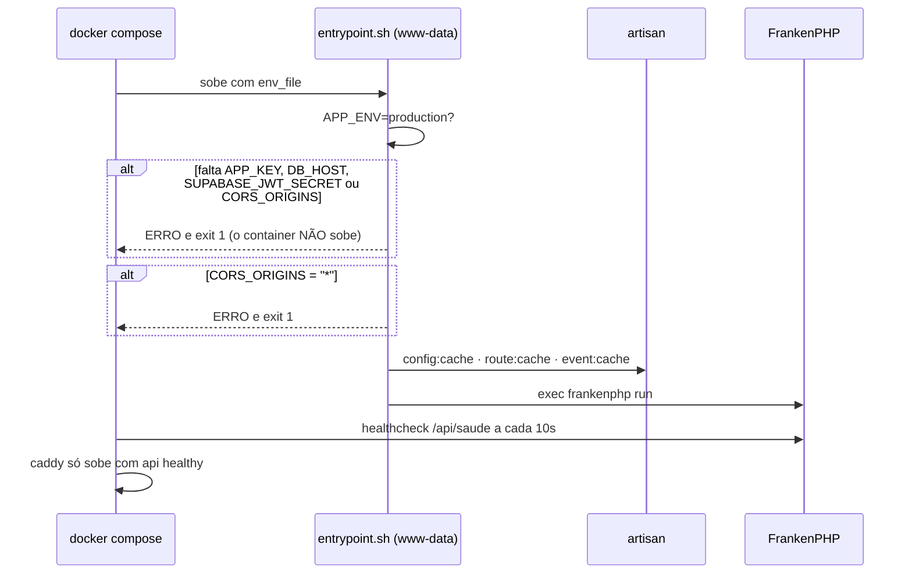
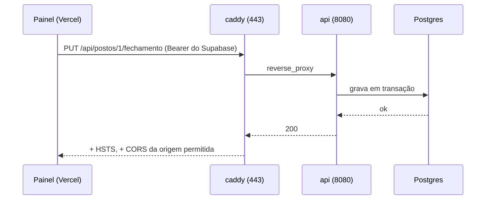

# Produção — Design Doc

Issue: #105 · Estado: implementado (imagem construída e provada localmente em 24/09/2026) · Data: 24/09/2026

> Este documento cobre **onde o backend roda**. A migração do **dado** — Supabase → Postgres da
> VPS, com conferência por valor — está no [`cutover.md`](cutover.md), e não muda aqui.

## 1. Contexto — o que muda para quem está fora

Até 24/09/2026 o backend Laravel só existia em desenvolvimento: `backend/Dockerfile` sobe
`php -S` com o código montado por volume, e o `docker-compose.yml` da raiz sobe um Postgres 17 na
porta 5433. Isso serve para editar e recarregar; não serve para atender o posto.

O que passa a existir com este documento:

| Antes | Agora |
|---|---|
| `php -S`, single-threaded, uma requisição por vez | FrankenPHP com 8 threads |
| código por volume (editar no host muda o que atende) | código dentro da imagem (imutável) |
| sem TLS | Caddy com certificado automático do Let's Encrypt |
| sem CORS configurado (`allowed_origins: ['*']` do framework) | `CORS_ORIGINS` obrigatória, e o container recusa subir sem ela |
| `.env` de desenvolvimento ao lado do código | ambiente por `env_file`, fora da imagem |
| banco local | o Postgres do Supabase (no ensaio; ver `cutover.md`) |

O painel é servido pela **Vercel em https**. Isso tem uma consequência que não é opcional: uma API
em **http** seria bloqueada pelo navegador como *mixed content*. HTTPS não é preferência aqui — sem
ele o painel simplesmente não fala com a API.

## 2. Subsistema — onde entra no monólito modular

**Não entra.** É deploy, não domínio: nada em `app/<Modulo>/` sabe que existe VPS. O que este
desenho toca do código é uma linha de configuração — `config/cors.php`, que o Laravel 13 não traz
por padrão e cujo padrão embutido libera qualquer origem.

```
internet ──▶ caddy (443, TLS) ──▶ api (8080, HTTP) ──▶ Postgres (Supabase)
             deploy/Caddyfile     backend/docker/Caddyfile
```

Dois containers, e a razão de serem dois: o edge guarda o certificado e o domínio, o app guarda a
aplicação. Reconstruir a API não derruba o TLS, e trocar o domínio não exige rebuild.

## 3. Componentes — com nomes

| Arquivo | O que é |
|---|---|
| `backend/Dockerfile.prod` | imagem de produção: FrankenPHP 1 / PHP 8.5, `composer install --no-dev`, OPcache sem `validate_timestamps`, roda como `www-data` |
| `backend/.dockerignore` | impede que `vendor/` (com as dev-deps), `.env` e `tests/` entrem na imagem |
| `backend/docker/Caddyfile` | o HTTP **interno**, em `:8080`, sem TLS e sem log de acesso |
| `backend/docker/entrypoint.sh` | recusa subir sem as chaves obrigatórias; refaz `config:cache`/`route:cache` a cada partida |
| `docker-compose.prod.yml` | os dois serviços; **só a `caddy` publica porta** |
| `deploy/Caddyfile` | o edge: TLS automático, cabeçalhos de segurança, log em `/data` |
| `deploy/.env.producao.exemplo` | o ambiente inteiro, comentado; o real (`deploy/.env.producao`) não é versionado |
| `deploy/sobe.sh` | `subir · atualizar · status · logs · saude · parar` |
| `backend/config/cors.php` | quem pode chamar a API pelo navegador |

### Decisão: FrankenPHP em vez de php-fpm + nginx

O plano registrado no `Dockerfile` de dev era php-fpm + nginx. A troca é deliberada e vale
registro: com FrankenPHP é **um processo em vez de três containers** (fpm + nginx + caddy), sem
socket, sem pool para dimensionar e sem `nginx.conf` para manter. O que se perde é familiaridade —
quem depurar vai encontrar Caddy, não nginx — e é o preço aceito.

Nota de campo: a imagem do FrankenPHP é **ZTS** e **já traz o OPcache compilado**. Passar `opcache`
para o `docker-php-ext-install` faz o build morrer com `cp: can't stat 'modules/*'` — erro que
parece dependência faltando e não é.

## 4. Comportamento

### A partida do container



### A requisição



### O que ligar no painel (o ensaio de 27/09/2026)

`VITE_API_URL` acende o strangler **inteiro** — as três telas mistas no mesmo minuto. Para acender
só o Fechamento de Caixa (o único caminho de escrita já migrado), a Vercel leva:

```
VITE_API_URL=https://api.<domínio>     # liga; o Fechamento segue este valor
VITE_API_DASHBOARD=0                    # Dashboard continua no Supabase
VITE_API_FORNECEDOR=0                   # Registro de Compras continua no Supabase
```

A flag lê-se em `corteDaTelaLigado` (`apps/web/src/services/api/base.ts`): `1`/`true` liga,
`0`/`false` desliga, e **ausente segue o global** — que é o que mantém o desenvolvimento como
sempre foi (basta `VITE_API_URL` no `.env.local`). A URL em si continua saindo de `urlDaApi()`,
porque quem a resolve é o `chamarApi`; a flag decide só QUAL caminho a tela toma.

> ⚠️ **Estado em 24/09/2026 — o ensaio ainda NÃO é de uma tela só.** Das três telas mistas, **duas
> obedecem** à flag: o Registro de Compras (`fornecedor.service.ts`) e o Fechamento (que segue o
> global, de propósito). O **Dashboard ainda não**: o corte dele mora em
> `aggregator.service.ts:409`, que é caminho de cálculo de dinheiro e está sob a trava de fórmula —
> ela barra a edição por **modelo**, e a sessão de 24/09 rodava no DeepSeek. Enquanto essa linha não
> mudar, `VITE_API_DASHBOARD=0` **não tem efeito** e o Dashboard acende junto com o global.
>
> Ligar o ensaio antes disso acende **duas** telas, não uma. A linha a trocar é a única do call
> site: `urlDaApi() !== null` → `corteDaTelaLigado(import.meta.env.VITE_API_DASHBOARD)`.

## 5. Contratos

### Variáveis que o container exige (recusa subir sem)

| Variável | Por quê |
|---|---|
| `APP_KEY` | sem ela o Laravel não cifra sessão nem cookie |
| `DB_HOST` | apontar para o banco de produção |
| `SUPABASE_JWT_SECRET` | é o que valida o token do painel; sem ele **todo login responde 401** |
| `CORS_ORIGINS` | sem ela o padrão do framework (`*`) deixa qualquer site chamar a API |

`CORS_ORIGINS` aceita uma ou mais origens separadas por vírgula, sem barra no fim.

### Endpoints de infraestrutura

| Rota | Quem usa | Contrato |
|---|---|---|
| `GET /api/saude` | healthcheck do compose | `200 {status:"ok"}` com banco; `503 {status:"degradado"}` sem |

### Portas

| Porta | Serviço | Exposta? |
|---|---|---|
| 80, 443 | caddy | sim — é o único ponto de entrada |
| 8080 | api | não — `expose`, só na rede do compose |

## Testes — o que prova que está certo

Rodado em 24/09/2026, na máquina de desenvolvimento, contra o Postgres local:

1. **A imagem constrói** — `docker build -f backend/Dockerfile.prod` (2m34s).
2. **As três travas recusam**, com saída 1: sem `CORS_ORIGINS`; com `CORS_ORIGINS=*`; sem
   `SUPABASE_JWT_SECRET`.
3. **A imagem não leva segredo nem dev-dep** — `/app/.env` não existe, `/app/tests` não existe, e
   o `vendor/bin` só traz ferramenta de runtime (sem pint, phpstan, pest, deptrac).
4. **Serve de verdade** — `GET /api/saude` → `200 {"status":"ok","banco":"posto"}`;
   `GET /api/postos/1/bicos` → `200` com dados; `GET /api/postos/1/fechamento` sem token → `401`.
5. **CORS barra origem estranha** — origem permitida recebe `Access-Control-Allow-Origin` com o
   próprio valor; origem estranha recebe o valor **da permitida**, que o navegador recusa por não
   bater. O preflight (`OPTIONS`) segue a mesma regra.
6. **Canário do corte por tela** — `base.test.ts`, 5 casos. Mutar `corteDaTelaLigado` para obedecer
   só ao global deixa **3 vermelhos**, incluindo o caso do ensaio.
7. **Gates do front** — oxlint, catraca eslint, catraca tsc, 969 vitest, 3499 golden: verdes.
8. **Gates do PHP** — Pint, PHPStan (0), PHPMD (0), Deptrac e Pest **196/196 com 96,8%**.

## Riscos e decisões em aberto

- **A VPS ainda não existe.** É o único item do caminho crítico que não depende de código. DNS do
  domínio apontando para ela e portas 80/443 abertas são pré-requisito do certificado.
- **O ensaio aponta para o Postgres do Supabase**, de propósito: evita migrar dinheiro de produção
  às pressas. Consequência a ter na cabeça: durante o ensaio, API e painel escrevem no **mesmo**
  banco por **dois** caminhos.
- **`auth_user_id` não está ligado em produção.** Sem isso a API responde 401 para todo mundo,
  mesmo com o token certo. É escrita em produção e precisa do "vai" explícito do dono.
- **Fila, cache e sessão seguem em arquivo.** Redis entra quando houver fila de verdade — hoje a
  escrita é síncrona. O `CLAUDE.md` §5 pede Redis para o caminho de escrita assíncrono, e isso é
  dívida registrada, não esquecimento.
- **Sem `docker compose down -v` no volume `caddy-dados`**: ele guarda o certificado, e o Let's
  Encrypt limita emissões por domínio por semana.